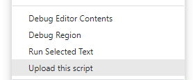

Getting started with Reports
==========================================

import Tabs from '@theme/Tabs';
import TabItem from '@theme/TabItem';

## Introduction
This tutorial shows you how to create and use reports in the ODSL language and the REST API.

### What is a report?
A [report configuration](/docs/odsl/variable/report) is a variable containing an expression that is used to generate a report.

When a report configuration is run, it produces a report.
The generated report is a variable of any type.

## Creating a report configuration

We are going to create a report that summarises usage metrics by user to see much each user is using the system.

### Creating the script
First we need to create a script that performs the aggregation of the metrics for the report.
Create an odsl file called ```report_functions.odsl``` and add the following code to it:

```js
/**
 * @category report
 * Example functions for creating reports
 */

function userMetrics()
    userMetrics = aggregate ${metric}
        match user != null and timestamp >= #START and timestamp <= #END
        group _id="$user", value=sum(1)
    end
end
```

Upload this file to the server by right-clicking in the code and selecting ```Upload this script```



This creates the function ```userMetrics``` which we will use in our expression.

:::note Date Range
Note the use of the variables #START and #END in the aggregation - these are the range of dates that are passed into the report build
:::

### Create the report

<Tabs groupId="tool">
<TabItem value="odsl" label="ODSL code" default>

```js
//#region Create a report
USER_METRICS = Report()
USER_METRICS.category = "Tutorial"
USER_METRICS.name = "User Metrics Summary"
USER_METRICS.description = "Summarise the usage metrics by user"
USER_METRICS.script = "report_functions"
USER_METRICS.expression = "userMetrics()"
USER_METRICS.tags = ["tutorial", "example"]

save USER_METRICS
//#endregion
```
</TabItem>
<TabItem value="rest" label="REST API">

```json
POST https://api.opendatadsl.com/api/reportconfig/v1/private

{
"_id": "USER_METRICS",
"_type": "VarReportConfiguration",
"category": "Tutorial",
"name": "User Metrics Summary",
"description": "Summarise the usage metrics by user",
"script": "report_functions",
"expression": "userMetrics()",
"tags": ["tutorial", "sample"]
}
```

</TabItem>
</Tabs>

### Test the report
We can test the report by executing the build method on the report configuration or getting the report

<Tabs groupId="tool">
<TabItem value="odsl" label="ODSL code" default>

```js
//#region Get and run the report
config = ${reportconfig:"USER_METRICS"}
report = config.build()
print report.data
//#endregion

//#region Run the report directly
report = ${report:"USER_METRICS"}
print report.data
//#endregion

//#region Run the report with a range
rep = ${report:"USER_METRICS", "_range=between(2023-01-01,2023-01-31)"}
print rep.data
//#endregion

```
</TabItem>
<TabItem value="rest" label="REST API">

```json
### Run the report
GET https://api.opendatadsl.com/api/report/v1/private/USER_METRICS

### Run the report for a date range
GET https://api.opendatadsl.com/api/report/v1/private/USER_METRICS
    ?_range=between(2023-01-01,2023-01-31)
```

</TabItem>
</Tabs>

## Saving reports
You can run and save a version of a report which will remain fixed, i.e. the data generated by the report configuration is now static in the report.

### Saving

<Tabs groupId="tool">
<TabItem value="odsl" label="ODSL code" default>

```js
//#region Run and save the report
save ${report:"USER_METRICS"}
//#endregion

//#region Run and save the report with a range
save ${report:"USER_METRICS", "_range=between(2023-01-01,2023-01-31)"}
//#endregion

```

</TabItem>
<TabItem value="rest" label="REST API">

```json
### Run and save the report
POST https://api.opendatadsl.com/api/report/v1/private/USER_METRICS

### Run and save the report for a date range
POST https://api.opendatadsl.com/api/report/v1/private/USER_METRICS
    ?_range=between(2023-01-01,2023-01-31)
```

</TabItem>
</Tabs>

### Getting the saved report
You can get the saved report by using the version number of the report or ~LATEST for the latest version of a report

<Tabs groupId="tool">
<TabItem value="odsl" label="ODSL code" default>

```js
//#region Get the saved report
rep = ${report:"USER_METRICS/~LATEST"}
print rep.data
//#endregion

```

</TabItem>
<TabItem value="rest" label="REST API">

```json
### Get the saved report
GET https://api.opendatadsl.com/api/report/v1/private/USER_METRICS/~LATEST
```

</TabItem>
</Tabs>