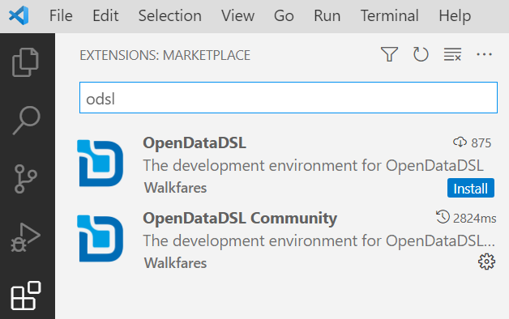

import StartBuilding from '/src/components/StartBuilding.js';
import {QuickStart} from '/src/components/Discovery.js';
import Track from '/docs/Tutorials/qs-mongodb/_track.md'

<QuickStart text="This quickstart track will help you learn how to use OpenDataDSL to manage data in your existing MongoDB databases" />

## Introduction
#### Welcome to the OpenDataDSL MongoDB quickstart track!

If you have programmed in other 2nd or 3rd generation languages at any level, you will easily grasp the core elements of the language, whilst appreciating the data management extensions.

## Preparation
This quickstart track requires some preparation in order to follow along with the content.

### Visual Studio Code
If you don't already have Microsoft VSCode installed, install it now using [this link](https://code.visualstudio.com/download)

#### ODSL Extension
Open VSCode and click on the extensions icon in the Activity Bar on the left or press (ctrl-shift-X) and then search for odsl

You can choose to install either the FREE community version or the full version if you have signed up for a commercial plan.

Click on the **Install** button to start the installation of the ODSL extension

Once installed, opening or creating a file with the extension `.odsl` initiates the ODSL editor

## Let's get started!

:::info
This quickstart track make extensive use of the [**MongoDB Sample Dataset**](https://www.mongodb.com/docs/atlas/sample-data/) which can be loaded into a MongoDB Atlas Cluster.
:::

<Track />
