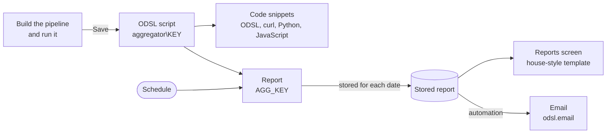

# Aggregator

The **Aggregator** lets you summarise the data in any platform service with an aggregation pipeline, and see the result as you build it. For example:

- Billed Fusion AI tokens per user this month
- Failed automations per target, with the latest error
- The number of timeseries and curves of each type
- Dataset deliveries for today, counted by status

When an aggregation does what you want, you can:

- **Save it** as an ODSL script, so scripts, processes and other people can run it
- **Schedule it** as a report that is stored for each date and formatted in the house style
- **Email it** each time it is stored
- **Copy the code** to run it from ODSL, curl, Python or JavaScript



An aggregation pipeline is a list of **stages**. Each stage takes the documents from the one before and passes on new ones: a `$match` keeps some of them, a `$group` summarises them, a `$sort` orders them, and so on. The Aggregator uses MongoDB aggregation stages, the same ones the [REST API](/docs/api/rest/aggregation) and the ODSL [aggregate command](/docs/odsl/command/aggregate) accept.

---

## Where to find it

| Where | What you do there |
|-|-|
| **Aggregator** (in the Extensions section of the menu), **Aggregations** tab | Find, open and create aggregations, or start from one of the examples |
| **Aggregator**, **Reports** tab | Every report made from an aggregation, with its schedule and email |
| **Reports**, **Aggregator** tab | For the selected report: its aggregation, schedule, email and stored dates, and the workspace to change them |

Opening or creating an aggregation shows the **workspace**: the pipeline on the left, the results on the right, and a toolbar with the service, the test dates, **Run**, **Save**, **Code** and **Reports**.

:::tip
The quickest way to start is an example. Open the **Aggregations** tab, pick one under **Start from an example**, press **Run**, then change it to suit you and **Save** it under your own name.
:::

---

## Pipeline

### Choosing the service

Choose the **Service** in the toolbar: the platform data the aggregation reads, such as master data objects, data, events, dataset deliveries, automation logs or Fusion AI usage. Services that have more than one source also ask for the **Source**:

| Source | What it holds |
|-|-|
| `private` | Your organisation's own data |
| `public` | Data published by OpenDataDSL |
| `common` | Shared data, such as dataset deliveries of common datasets |
| `all` | Private and common together, where the service supports it |

Services such as automations, processes and Fusion AI usage have a single source, so the source is not asked for. **Another service...** at the end of the list lets you type the name of any other service.

**Sample documents** reads five documents of the service and lists their fields. Click a field to put it into the stage you last edited, as `"$field"`. Fields of the last results are listed too, which helps when you write a stage that works on the output of a `$group`.

### Adding stages

Each stage is a card with its operator, its value as JSON, and buttons to:

- **Run up to this stage**, to see what the pipeline produces at that point
- turn the stage **off** without deleting it
- move it up or down, duplicate it or remove it

The six stages used most have their own buttons under the pipeline: `$match`, `$sort`, `$limit`, `$project`, `$group` and `$count`. These are known to work on every service. **All stages** lists every MongoDB aggregation stage:

| Group | Stages |
|-|-|
| Filter and sort | `$match` `$sort` `$limit` `$skip` `$sample` `$redact` |
| Shape documents | `$project` `$addFields` `$set` `$unset` `$replaceRoot` `$replaceWith` |
| Group and summarise | `$group` `$count` `$sortByCount` `$bucket` `$bucketAuto` `$facet` |
| Arrays and nesting | `$unwind` |
| Time series and windows | `$densify` `$fill` `$setWindowFields` |
| Combine and join | `$lookup` `$graphLookup` `$unionWith` `$documents` `$geoNear` |
| Search (Atlas) | `$search` `$searchMeta` `$vectorSearch` `$rankFusion` `$scoreFusion` `$listSearchIndexes` |
| Diagnostics | `$collStats` `$indexStats` `$planCacheStats` `$currentOp` `$listSessions` `$listLocalSessions` `$listSampledQueries` `$shardedDataDistribution` `$querySettings` `$changeStream` `$changeStreamSplitLargeEvent` |
| Write | `$out` `$merge` (not allowed) |

A new stage starts with an example value to change. Under each stage is a line of help and a link to its MongoDB documentation. A stage value is JSON, so field names and strings need double quotes: `{"status": "failed"}`, not `{status: 'failed'}`. A stage that is not valid JSON is outlined in red with the position of the problem.

:::caution Where a stage can run
Some stages carry a note under them:

- **Joins** (`$lookup`, `$graphLookup`, `$unionWith`) read other collections by their database name, which is not always the service name, and only the service you chose is filtered to your data.
- **Atlas search** stages need MongoDB Atlas with a search index on the collection.
- **Diagnostics** are usually refused for application users.
- Some stages, such as `$geoNear`, `$documents` and the search and diagnostic stages, must be the **first** stage. On services the platform filters to your organisation (automations, Fusion AI usage and runs, users and others), and when your read policies restrict what you can see, the platform adds its own filter first, so these stages cannot run there.
- Newer stages need a recent MongoDB version, which the note gives.

Stages that write to the database (`$out`, `$merge`) and change streams cannot be used.
:::

### Date placeholders

Three placeholders can be used inside any string value of a stage:

| Placeholder | In the workspace | In a report |
|-|-|-|
| `@{ondate}` | The **Ondate** test date in the toolbar | The date the report runs for |
| `@{start}` | The **Start** test date | The start of the report's default range |
| `@{end}` | The **End** test date | The end of the report's default range |

Each is replaced with a date written as `yyyy-mm-dd`. For example, this keeps the documents of the report's range, to the end of its last day:

```json
{"timestamp": {"$gte": "@{start}T00:00:00", "$lte": "@{end}T23:59:59"}}
```

### How values are read

The platform converts string values in a pipeline before it runs: a string that looks like a date becomes a date, `"10"` becomes a number and `"true"` becomes true. This is what lets `"@{start}T00:00:00"` be compared with a date field. To keep a value as a string, write it as `"string@2026-01-01"`. A field called `ondate` is kept as an ondate string.

### Results

**Run** (or Ctrl+Enter) runs the pipeline and shows:

- the number of rows and columns, how long it took and the stages run
- the rows as a **Table**, sortable by any column, or as **JSON**
- **CSV**, to download the rows

Nested fields are shown as columns with dotted names, such as `_id.playbook`. The preview stops at 1,000 rows when the pipeline has no `$limit` or `$count` of its own; a saved aggregation, a report and the code snippets are not limited.

---

## Saving an aggregation

**Save** asks for a name, a description and a **key**. The aggregation is saved as a private ODSL script called `aggregator\KEY` in the category `aggregation`, with one function, `aggregate_KEY`, that runs the pipeline and returns the rows. The key is made from the name, can use lower case letters, digits and underscores, and cannot be changed later. **Save as a new aggregation** (under the menu) saves a copy under another key.

The function takes the three dates for the placeholders:

```js
aggregate_fusion_ai_tokens_by_user(ondate, fromDate, toDate)
```

:::note
Open the script in the Aggregator to change it: changes made to the script by hand are replaced the next time the aggregation is saved.
:::

The menu also has **Download the definition** (the aggregation and its pipeline as JSON), **Paste a pipeline** (a JSON array of stages, for example one copied from another tool) and **View the saved script**.

---

## Code snippets

**Code** opens the aggregation as code you can copy or download:

| Language | What it does |
|-|-|
| **ODSL** | The `aggregate` command with the stages written in, and the test dates filled in |
| **ODSL (saved script)** | Imports the saved script and calls its function with dates. Save the aggregation first. |
| **curl** | One request to the REST API with the pipeline in the `_aggregate` parameter |
| **Python** | A function that calls the REST API with the `requests` package and returns the rows |
| **JavaScript** | The same with `fetch`, for Node 18 or later |

For curl, Python and JavaScript choose how to sign in: an **API key** (your email address and key, sent as the `x-odsl-email` and `x-odsl-key` headers) or an **access token** (sent as a bearer token). The code reads them from environment variables, so they are never written into it. When the portal is not on the production environment, the code also sends the environment.

The Python and JavaScript code keep the date placeholders and fill them from `PARAMS`, so you can run them for other dates:

```python
rows = run_aggregation({"ondate": "2026-10-10", "start": "2026-10-01", "end": "2026-10-31"})
```

---

## Reports

A report runs a saved aggregation and **stores the result for each date**, by a schedule or when you ask. Stored reports can be opened on the Reports screen, formatted with a house-style template, and emailed.

To create one, save the aggregation, select **Reports** in the toolbar, then **New report**. A report has:

| Setting | |
|-|-|
| **Report ID** | `AGG_` and the aggregation key by default. It cannot be changed later. |
| **Name**, **Description** | Shown on the Reports screen, in the template and in the email |
| **Schedule** | When it runs, see below |
| **Template** | How it looks, see below |
| **Email** | Who it is sent to each time it is stored, see below |

The report runs the function of the saved aggregation, `aggregate_KEY(#ONDATE, #START, #END)`. Saving the aggregation again changes what the report produces from its next run.

**Preview** runs the saved aggregation on the platform for the **Ondate** test date, without storing anything, and shows the result in the template.

### Schedule

Tick **Run on a schedule** and choose **When**:

| When | Cron |
|-|-|
| Weekdays at 08:00 UK time | `0 8 * * MON-FRI * EU1` |
| Weekdays at 07:00 Central European time | `0 7 * * MON-FRI * EU2` |
| Weekdays at 18:00 UK time | `0 18 * * MON-FRI * EU1` |
| Every day at 06:00 UTC | `0 6 * * * * UTC` |
| Mondays at 08:00 UK time | `0 8 * * MON * EU1` |
| The first of each month at 08:00 UK time | `0 8 1 * * * EU1` |

Or choose **Custom** and write a cron: minute, hour, day of the month, month, day of the week, year and time zone. See [CRON expressions](/docs/kb/cron).

The **Default range** sets the start and end dates, `#START` and `#END`, that the `@{start}` and `@{end}` placeholders take, for example `from(2026-01-01)` or `last(7)`. Leave it empty for all dates.

### Templates

A report is shown with one of two templates:

| Template | |
|-|-|
| **House-style Mustache template** | Generated from the columns you choose and saved as the script `aggregator\templates\REPORT_ID`. A header with the report name, description and date, and a table of the rows, in the OpenDataDSL house style. You can edit it. |
| **Generic table** | Every column of the rows, sortable and paged, with CSV export. Nothing to maintain. |

For the generated template, the **Columns** come from the last results in the workspace, or from **Columns from a test run**. For each column you can change the heading and the type (text, number or date), move it, or leave it out. Changing the columns writes the template again, until you edit the template by hand; **Generate again** goes back to the generated one.

In the template, `{{name}}`, `{{description}}` and `{{ondate}}` are the report's, and `{{#data}} ... {{/data}}` repeats for each row, with the fields of the row by name:

```html
{{#data}}
<tr>
	<td>{{user}}</td>
	<td class="num">{{tokens}}</td>
</tr>
{{/data}}
```

:::tip
A template can only show fields with simple names, such as `user` or `_id.playbook`. Use a `$project` stage to give fields the names and values you want to show, and `$round` to round numbers, which the template prints as they are.
:::

### Email

Tick **Email the report each time it is stored**, then give:

| Setting | |
|-|-|
| **To** | One or more email addresses, separated by commas. Recipients must be in your organisation's email domain unless your organisation allows others. |
| **Subject** | `${date:dd MMM yyyy}` in the subject is replaced with the report date, in any Java date format |
| **Columns** | The report's columns, or untick **Use the report columns** to choose others |

The email is formatted by its own generated template, saved as the script `aggregator\templates\REPORT_ID_email`. It uses tables and inline styles so that it looks the same in every email client, and can be edited and previewed with **Preview the email**.

Saving the report creates an **automation** on it with the platform's email target, `odsl.email`: each time a date of the report is stored, by the schedule or by **Build this date**, the report is formatted with the email template and sent. The automation is listed under **Automations** for the report on the Reports screen, where it can be turned off. Unticking the email and saving the report removes it.

:::note
Automations you add to a report yourself are not changed by the Aggregator.
:::

### Builds

For a saved report, **Builds** lists the stored dates. Open one to see it as the platform shows it. **Build this date** runs the report for a date and stores it, as the schedule does, and sends the email when the report has one.

---

## The Aggregator tab on the Reports screen

On the **Reports** screen, select a report and open the **Aggregator** tab. For a report made by the Aggregator it shows:

- the aggregation, the service it reads, and its stages
- the schedule, the template and the email
- the stored dates, with **Build this date**

**Open the aggregation** opens the workspace on its aggregation; **Edit the report** opens it with this report ready to change. **Back** returns to the summary. For any other report, the tab offers **New aggregation**.

---

## Examples

The **Aggregations** tab has examples to start from. Each opens unsaved, so you can change it and save it under your own name.

| Group | Example | Service | Shows |
|-|-|-|-|
| Fusion AI | Fusion AI tokens by user | Fusion AI usage | `$match` on a date range, `$group`, `$sort`, `$project` |
| Fusion AI | Fusion AI tokens by day | Fusion AI usage | Counting distinct users with `$addToSet` and `$size` |
| Fusion AI | Heaviest Fusion AI conversations | Fusion AI usage | `$first`, `$sort` and `$limit` for a top 20 |
| Fusion AI | Playbook runs by status | Fusion AI playbook runs | Grouping by two fields |
| Fusion AI | Scheduled playbook tasks | Fusion AI tasks | A filtered list without grouping |
| Automations | Automation failures by target | Automation logs | `$max` for the latest failure, `$last` for its message |
| Automations | Automation runs by day | Automation logs | `$set` with `$dateToString` to group by day |
| Automations | Automations by target and service | Automations | Grouping the automation conditions |
| Automations | Automation success rate by target | Automation logs | `$cond`, `$divide` and `$round` to calculate a percentage |
| Data and master data | Data by type | Data | A count per type |
| Data and master data | Master data by type | Master data objects | A count per type, top 50 |
| Data and master data | Data overview in one row | Data | `$facet`: a total, a count per type and the latest updates together |
| Data and master data | Dataset deliveries by status | Dataset deliveries (common) | `$sortByCount` for the deliveries of the ondate |
| Platform | Scripts by category | Scripts | A count and the latest change per category |
| Platform | Recently changed scripts | Scripts | `$sort`, `$limit` and renaming fields |
| Platform | Reports by type and schedule | Report configurations | `$cond` and `$ifNull` |

---

## Troubleshooting

| What you see | Why, and what to do |
|-|-|
| **No rows** | Check the `$match` conditions and the test dates. Strings that look like dates or numbers are converted: write `"string@..."` to compare with a string. |
| A stage is outlined in red | Its value is not valid JSON. Field names and strings need double quotes. |
| **... is not allowed** | `$out`, `$merge` and change streams cannot be used. |
| A stage fails on a service it should work on | Read the note under the stage: it may need to be first, need Atlas, or need a newer MongoDB version. |
| **Unknown function: aggregate_...** when a report runs | The report could not use the saved script. Open the aggregation in the Aggregator once, which saves it again, then run the report again. |
| The email is not sent | Check the recipients are in your email domain, and that the automation is on under **Automations** for the report. The email is only sent when a date is stored. |
| The email automation is not under **Automations** | It was made by an earlier version of the Aggregator. Open the report in the Aggregator and save it once. |
| A template shows nothing for a field | The field name has characters a template cannot read, such as spaces. Rename it with `$project`. |

---

## Reference

| What | Where it is saved |
|-|-|
| An aggregation | Private script `aggregator\KEY`, category `aggregation`, with the function `aggregate_KEY(ondate, start, end)` |
| A report | Private report configuration, ID `AGG_KEY` by default, running `aggregate_KEY(#ONDATE, #START, #END)` |
| The report template | Private script `aggregator\templates\REPORT_ID` |
| The email template | Private script `aggregator\templates\REPORT_ID_email` |
| The email | An automation on the report: target `odsl.email`, when the report is updated, transformed by the email template |
| Stored reports | One per date, in the report service |

The Aggregator is installed as the extension `odsl.aggregator`. Its feature policy, `extension.odsl.aggregator`, gives access to the Aggregator view (`odsl.aggregator.manage`) and the tab on the Reports screen (`odsl.aggregator.report`).
