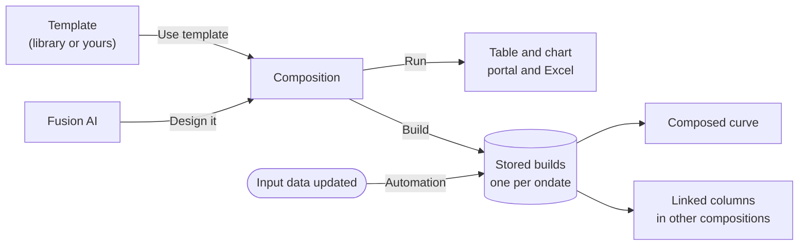

# What is Composer?

**Composer** lets you build your own analytic worksheets, called **compositions**, without writing a script. A composition lines up curves or timeseries side by side and adds columns calculated from them, for example:

- Brent and WTI by tenor, with the spread between them
- The clean spark spread of a gas plant: power, less gas and carbon per MWh generated
- The daily average, high and low of an hourly price
- A gas hub converted to EUR per MWh, against TTF

A composition is shown as a table and a chart. It is saved as a report, so it can be opened in the portal and in the Excel Add-in, built every day, published as a curve, and run automatically when its data changes.

---

## Templates and compositions

Composer works like [Fusion AI playbooks and tasks](/docs/topics/fusion-ai-playbooks/overview):

| Composer | What it is |
|-|-|
| **Library** | Ready-made composition templates from OpenDataDSL, such as Curve spread, Clean spark spread or 3:2:1 crack spread |
| **My templates** | Your organisation's own templates: ones you wrote, or copies of library templates you changed |
| **Inputs** | The values a template asks for when it is used, such as which curves to compare or a plant efficiency |
| **Composition** | A worksheet created from a template (with its inputs filled in) or from scratch, that you can change and save |

You can also describe what you want and let **Fusion AI** design the composition for you. See [Designing with Fusion AI](/docs/extensions/composer/fusion-ai).

---

## Two kinds of worksheet

Every composition is one of two types, chosen when it is created:

| Type | Rows | Typical use |
|-|-|-|
| **Curve** | The tenors of the curves for one ondate (M01, M02, Q01 ...) | Spreads, cracks, forward prices converted to another currency, a curve formula |
| **Timeseries** | Dates, aligned to a calendar | Spot prices, statistics over a period, the history of a curve tenor such as the front month |

On a timeseries worksheet, a column can also show one tenor of a curve as a timeseries, for example the front month of a gas curve each day.

---

## Columns

A composition is a list of columns. Each column is one of three kinds:

| Column | What it shows |
|-|-|
| **Data** | A curve or a timeseries from the platform, optionally converted to another currency or unit |
| **Expression** | A calculation from the columns before it, for example `BRENT - WTI` or `POWER - GAS / 0.49`, using any ODSL function |
| **Linked** | A column of another composition, so one worksheet can build on another |

---

## What you can do with a composition

- **Run** it for any date to see the table and chart.
- **Build** it for a range of ondates to store the results. Stored builds open instantly, and are what composed curves and linked columns read.
- Publish one of its columns as a **composed curve**: a curve on a master data record that you can use like any other curve.
- Let it **build automatically** when its input data, or a composition it links to, is updated.

---

## Where to find Composer

| Where | What you do there |
|-|-|
| **Composer** (in the Extensions section of the menu), **Compositions** tab | Find, open and create compositions. Filter by analytics area, owner, template and stage. |
| **Composer**, **Library** tab | Browse the OpenDataDSL templates, use one, or copy it to make it your own |
| **Composer**, **My templates** tab | Create and edit your organisation's templates |
| **Master Data**, **Composer** tab | The compositions stored on the selected record, and new ones that use its curves and timeseries |

:::tip
Start with [Getting started](/docs/extensions/composer/getting-started), which walks through creating a composition from the library in a few minutes.
:::

---

## Where compositions are stored

A composition is stored on a master data record in your private data:

- An **analytics area**: a master data record of type `analytics_area` that holds compositions, such as "Gas Analytics" or "Power Desk". Composer creates one the first time you save to a new area.
- Or an existing master data record, such as the record for a market or a product, so the composition sits with the data it analyses.

Its id is the record id and a key made from the owner and the name, for example `GAS_ANALYTICS:COLIN_HARTLEY_TTF_NBP_SPREAD`. The key does not change when you rename the composition.
