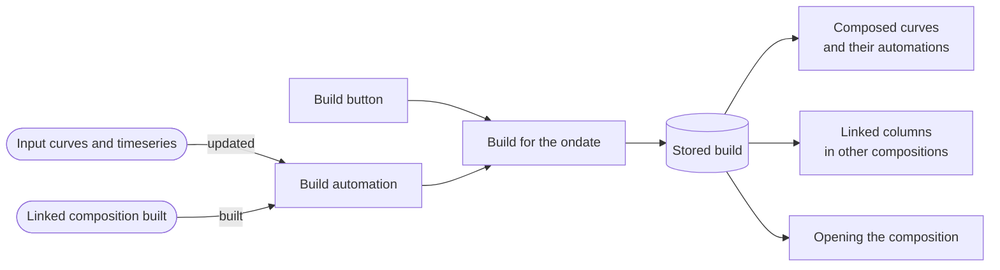
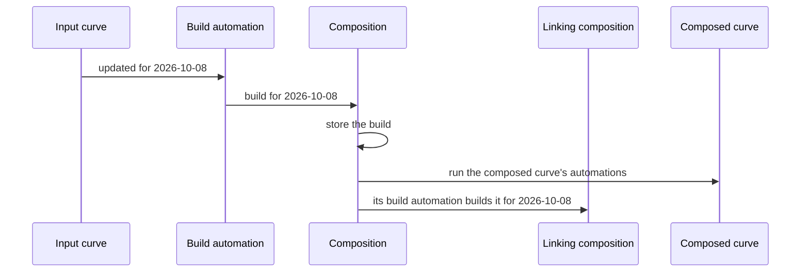

# Builds, composed curves and automation

**Running** a composition calculates it on the fly and shows the result. **Building** it calculates it for an ondate and **stores** the result, a build. Builds are what make a composition useful beyond the screen:

- A stored build opens straight away, without calculating it again.
- A **composed curve** is a curve made from a column of the builds.
- A **linked column** in another composition reads the builds.
- **Automation** builds the composition when its data changes.

---

## Building for a range of ondates

Save the composition, then select **Build** in the toolbar (or **Build for a range of ondates** under Properties, **Builds**). Choose:

| Setting | |
|-|-|
| **From ondate**, **To ondate** | The range to build, up to 750 ondates at a time |
| **Ondates** | **Weekdays** or **Every day** |
| **Ondates already built** | Tick **Build them again** to rebuild them; by default they are skipped |

Composer builds three ondates at a time and shows its progress; **Cancel** stops it after the ondates in progress. The summary lists:

- the ondates that failed, and why,
- the ondates that were built without all their data: no rows, or a column that failed, usually because an input curve did not exist for that ondate. These builds are stored, but composed curves and linked columns get no values from them until they are built again.

Properties, **Builds** shows how many ondates are built, the first and the latest.

:::note
A curve composition fixed to one ondate (Properties, **Ondate**) gives the same result for every ondate, so it is not built for a range.
:::

---

## Composed curves

A **composed curve** publishes one column of a curve composition as a curve on a master data record. It is read like any other curve, for example `OIL_ANALYTICS:BRENT_WTI_SPREAD:2026-10-08`, and can be used in the portal, Excel, scripts and other compositions.

To create one:

1. Save the composition.
2. Open the column in the **Columns** panel.
3. Under **Composed curve**, select **Create composed curve...**.
4. Choose the master data record (by default the one the composition is stored on), the curve id, its name and description.

The composed curve has a curve for every ondate the composition has been built for. Its currency, units and timezone are those of the column, and its history of a tenor comes from the builds too. The column, and Properties, **Builds**, list the composed curves made from the composition.

:::caution
A composed curve refers to the column by its id. Renaming the column's id breaks the composed curve.
:::

If a composed curve has no values for an ondate, reading it explains why: the composition has not been built for that ondate, the build has no rows, or the column failed in that build.

---

## Linked columns

A linked column (see [The workspace](/docs/extensions/composer/workspace)) shows a column of another composition by reading that composition's build for the same ondate. Build the linked composition for the ondates you need, or let automation do it: when the linked composition is built, the compositions that link to it are built too.

Links read stored builds, never each other live, so two compositions can safely link to each other. Automation does not build a loop of links (A links to B, which links back to A, directly or through others).

---

## Automation

A saved composition is built automatically when its data changes. Under Properties, **Automation**:

- **Build automatically when its inputs or linked compositions are updated** is on by default. Clear it to build only when you choose.
- The list shows what triggers a build: each curve or timeseries its columns read (for a curve tenor column, the curve) and each composition it links to.

When you save the composition, the platform keeps one automation for it, named "When an input is updated, build Composition ...". It builds the composition for the ondate of the update, or for today when the update has no ondate (a timeseries), and stores it, just like **Build**. The automation is removed when the composition has no inputs, is not enabled, or has automatic builds turned off.

### Automations on composed curves

You can add automations to a composed curve like any other curve, for example to email the curve or send it to a queue whenever it changes. A composed curve changes whenever its composition is built, so its automations run each time a build is stored (by **Build**, by the build automation, or by a schedule), with the curve for that ondate.

:::tip
Combine the two: the composition builds when its inputs settle, and an automation on its composed curve sends the result on.
:::
