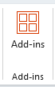
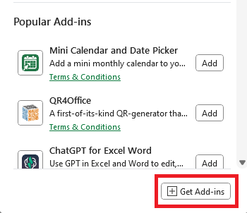

Excel Add-in
===========================
import {Excel} from '/src/components/Schema'
import {InDepth} from '/src/components/Discovery.js';

<Excel />

Our free Microsoft Excel Add-in is a Microsoft approved Office 365 Add-in available from the Microsoft store. 
It can be used with both the Desktop version and Web version of Excel. 

## Features

* Create, read and update Master Data
* Create, read and update Timeseries
* Create, read and update Forward Curves
* Create, read and update Matrices
* Create, read and update Events
* Read Reports

## Products supported

* Excel 2019 or later on Mac
* Excel on Mac (Microsoft 365)
* Excel on Windows (Microsoft 365)
* Excel on the web

## Installation

To add the OpenDataDSL Add-in to your Office 365 Excel:

1. Go to the **Home** tab and click the **Add-ins** button.

  

2. Select the Get Add-ins button

3. In the **Office Add-ins** dialog, select **STORE** and in the search box and type *opendatadsl* or *odsl*
  

4. Click the **Add** button to add it to your Excel

5. Go to the **Home** tab and you should now see an OpenDataDSL **Show Dashboard** button

### The dashboard

To show/hide the OpenDataDSL add-in task pane, use the **Show Dashboard** button available on the **Home** tab.

### First time log-in

The first time you click on the **Show Dashboard** button you will be asked to log in. 
You should log in using the same corporate credentials you use to log into the **ODSL Web Portal**.

## Using the Excel Add-in

### Toolbar
The toolbar contains commands to help you work with your data

|Icon|Description|
|-|-|
||Navigates to the home screen|
||Contains commands to create new ODSL objects, timeseries, curves, and events|
||Contains commands to download ODSL objects, timeseries, curves, and events|
||Upload new or updated data|
||Refresh the data in your spreadsheet|
||Add-in settings|
||Current user profile picture. The drop-menu contains commands to logout and to view copyright information|

### Finding Data
From the home screen in the dashboard, click one of Timeseries, Curves, Events or Master Data Records and type your search query into the search box to get a list of items.
Entering further search terms will narrow down the items

<InDepth href="/docs/user/excel/finding-data" />

### Working with Master Data
Master Data Records in OpenDataDSL are the top level structures that contain information and links to all its associated data.

<InDepth href="/docs/user/excel/objects" />

### Working with TimeSeries

<InDepth href="/docs/user/excel/timeseries" />

### Working with Curves

<InDepth href="/docs/user/excel/curves" />

### Working with Curve Series

<InDepth href="/docs/user/excel/curveseries" />

### Working with Matrices

<InDepth href="/docs/user/excel/matrices" />

### Working with Events

<InDepth href="/docs/user/excel/events" />

### Working with Reports

<InDepth href="/docs/user/excel/reports" />

### Excel Functions

<InDepth href="/docs/user/excel/functions" />
