## What are curves?
A Curve is a structure containing an array of contracts which each define a period of time in the future from the perspective of the curve.

You have access to all public and your own private data from the Excel Add-in, this document shows you how to find the data you need.

### Creating a new curve

1.	From the toolbar select **New > Curve**. 
      
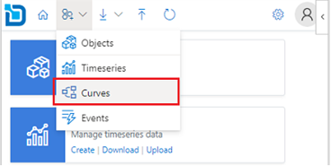

Alternatively, you can click on the Create link from the Curve card on the home page. 


2.	On the new curve configuration pane select **Object Type**, **Curve Date**, **Expiry Calendar** and specify **Id** for the curve being created. 

:::info Id Format
The id should include the object id and curve id in the format ```<object id>:<curve id>```
:::

Additionally, you can specify **Currency** and **Unit** fields for the curve.

:::info Multiple Curves
To create multiple curves, specify multiple ids separated by comma, space, or semicolon. 
:::

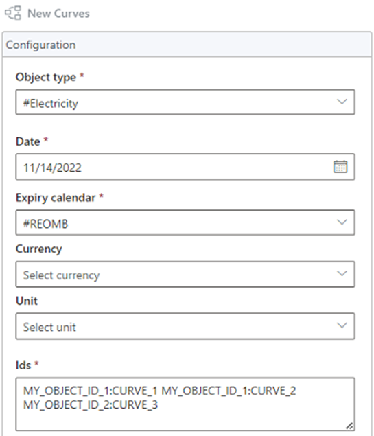

3.	Under **Options** you can choose how you want to create the curves.


:::info
#### Add only template to worksheet
This option will only add the curve layout to the worksheet, but the curve is not created. 
You need to manually upload the data for the curve to get created.

#### Create and add to worksheet
This option will create the curve first and upon successful will add the curve layout to the worksheet.

#### Create Only
This option will only create the curve, it does not add to the worksheet. 
You can load the newly created curve later from the Downloads section.
:::

4.	Select the display layout for the curves on the worksheet.


:::info
#### Horizontal
This option will put the curve ids on the first column, tenors on the first row and data flows horizontally

#### Vertical
This option will put the curve ids on the first row, tenors on the first column and data flows vertically.
:::

5.	Click **Create** to create the curve based on the configuration.

### Downloading curves

1.	From the toolbar select **Download > Curves**. 
      
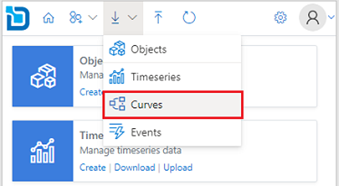

Alternatively, you can click on the Download link from the Curve card on the home page. 


2.	Search for the curves you want to download. You can use filters and or the search box to narrow down the search results.

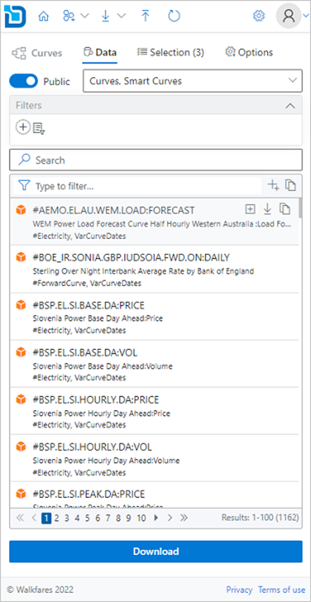

3.	Click the   download icon on each item to download data to the spreadsheet. 
      To add multiple curves, you can click the   plus icon to add to the selection and then click the **Download** button.
      
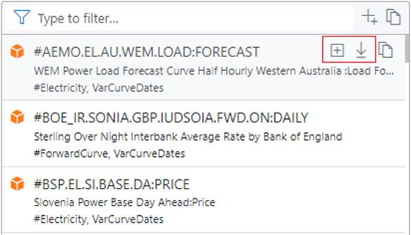

4.	Optionally, before downloading you can select the curve **Date** and the **Timezone** to use for the displayed data from the **Options** tab. 
      
You can also select whether the data should be shown as curve data and the columns to include.

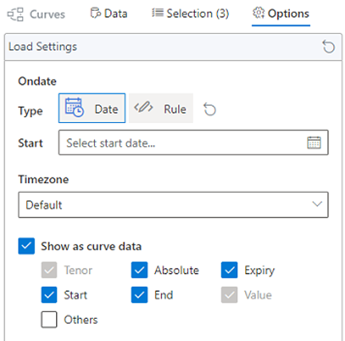

5.	Select the display layout for the curves on the worksheet.


:::info
#### Horizontal
This option will put the curve ids on the first column, tenors on the first row and data flows horizontally.

#### Vertical
This option will put the curve ids on the first row, tenors on the first column and data flows vertically.
:::

6.	Click **Download** to download the curves onto the worksheet.

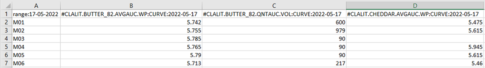

### Updating existing curves

1.	From the toolbar select **Upload**. 


Alternatively, you can click on the **Upload** link from the **Curve** card on the home page.


2.	Select the curve range from the available ranges listed from the worksheet.

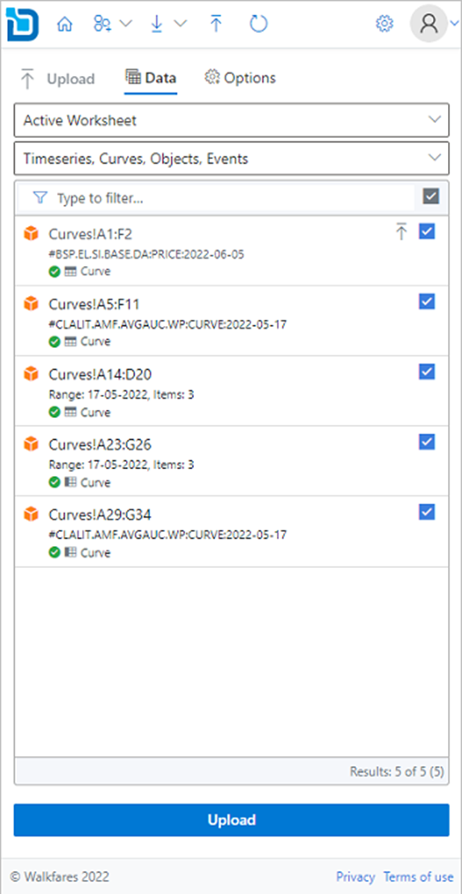

3.	Click the  upload icon to upload the data. 
      To update multiple curves, use the check boxes to toggle on/off from the range items listed and then click **Upload** button.

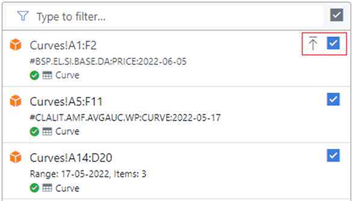

4.	Optionally, before uploading you can specify default settings for new curves which are not yet created. This step can be ignored if all the items already exist.


5.	Click **Upload** to upload the curve from your worksheet.

### Refreshing existing curves

1.	From the toolbar select **Refresh**. 
      


Alternatively, you can click on the **Curves** link from the **Refresh** card on the home page.


2.	Select the curve range from the available ranges listed from the worksheet.

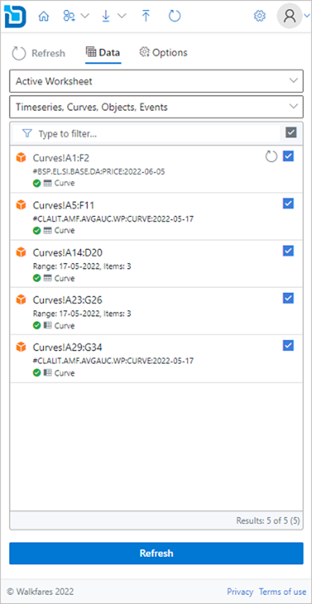

3.	Click the   refresh icon to refresh the data. 
      To refresh multiple curves, use the check boxes to toggle on/off from the range items listed and then click **Refresh** button.
      
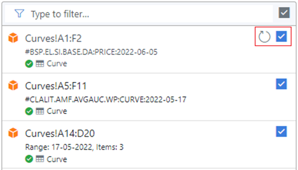

4.	Click **Refresh** to refresh the curves data on your worksheet.
