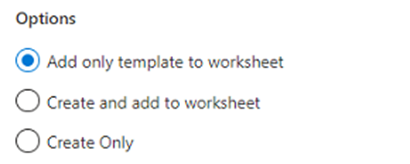
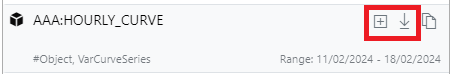

## What are curve series?
A Curve Series is a timeseries for a specific point in time with values usually representing a point in time in the future.
Curve Series are usually used instead of a curve when representing a lot of data, such as an hourly power curve. 

You have access to all public and your own private data from the Excel Add-in, this document shows you how to find the data you need.

### Creating a new curve series

1.	From the toolbar select **New > Curve Series**.


Alternatively, you can click on the Create link from the Curve card on the home page.


2.	On the new curve series configuration pane select **Object Type**, **Date**, **Calendar** and specify **Id** for the curve being created.

:::info Id Format
The id should include the object id and curve series id in the format ```<object id>:<curve id>```
:::

Additionally, you can specify **Expiry Calendar** **Currency** **Unit** and **timezone** fields for the curve.

:::info Multiple Curve Series
To create multiple curve series, specify multiple ids separated by comma, space, or semicolon.
:::


3.	Under **Options** you can choose how you want to create the curve series.



:::info
#### Add only template to worksheet
This option will only add the curve series layout to the worksheet, but the curve series is not created.
You need to manually upload the data for the curve series to get created.

#### Create and add to worksheet
This option will create the curve series first and upon successful will add the curve series layout to the worksheet.

#### Create Only
This option will only create the curve series, it does not add to the worksheet.
You can load the newly created curve series later from the Downloads section.
:::

4.	Select the display layout for the curve series on the worksheet.


:::info
#### Horizontal
This option will put the curve series ids on the first column, dates on the first row and data flows horizontally

#### Vertical
This option will put the curve series ids on the first row, dates on the first column and data flows vertically.
:::

5.	Click **Create** to create the curve series based on the configuration.

### Downloading curve series

1.	From the toolbar select **Download > Curve Series**.


Alternatively, you can click on the Download link from the Curve Series card on the home page.


2.	Search for the curve series you want to download. You can use filters and or the search box to narrow down the search results.


3.	Click the   download icon on each item to download data to the spreadsheet.
      To add multiple curve series, you can click the   plus icon to add to the selection and then click the **Download** button.



4.	Optionally, before downloading you can select the curve **Date**, the **Date Range** and the **Timezone** to use for the displayed data from the **Options** tab.


5.	Select the display layout for the curve series on the worksheet.


:::info
#### Horizontal
This option will put the curve series ids on the first column, dates on the first row and data flows horizontally.

#### Vertical
This option will put the curve series ids on the first row, dates on the first column and data flows vertically.
:::

6.	Click **Download** to download the curve series onto the worksheet.


### Updating existing curve series

1.	From the toolbar select **Upload**.


Alternatively, you can click on the **Upload** link from the **Curve Series** card on the home page.


2.	Select the curve series range from the available ranges listed from the worksheet.


3.	Click the  upload icon to upload the data.
      To update multiple curve series, use the check boxes to toggle on/off from the range items listed and then click **Upload** button.


4.	Optionally, before uploading you can specify default settings for new curves which are not yet created. This step can be ignored if all the items already exist.


5.	Click **Upload** to upload the curve series from your worksheet.

### Refreshing existing curve series

1.	From the toolbar select **Refresh**.


Alternatively, you can click on the **Curve Series** link from the **Refresh** card on the home page.


2.	Select the curve series range from the available ranges listed from the worksheet.


3.	Click the   refresh icon to refresh the data.
      To refresh multiple curve series, use the check boxes to toggle on/off from the range items listed and then click **Refresh** button.


4.	Click **Refresh** to refresh the curve series data on your worksheet.
