## What are matrices?

Matrices are a table of data with labelled rows and columns

Example:

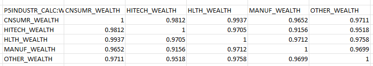

Example uses of a matrix are:
* A correlation matrix
* A covariance matrix
* A table of statistical information

You have access to all public and your own private data from the Excel Add-in, this document shows you how to find the data you need.

### Creating a new matrix
1.	From the toolbar select **New > Matrices**.

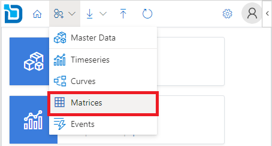

Alternatively, you can click on the Create link from the Matrices card on the home page.


2.	On the new matrix configuration pane, enter the details for the matrix being created.

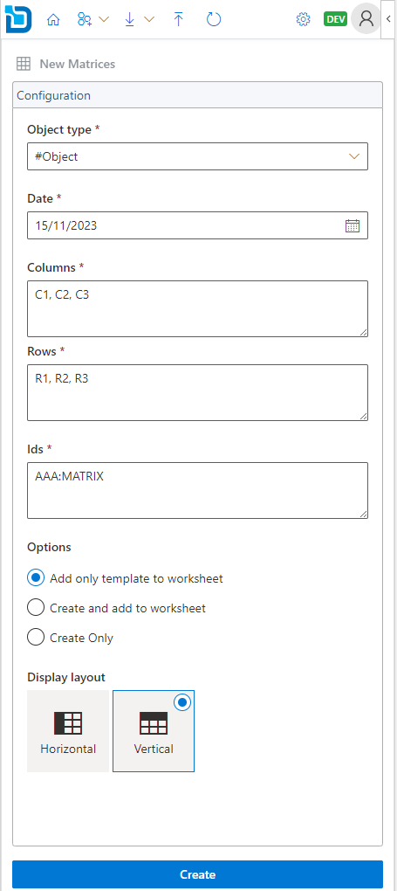

:::info Id Format
The id should include the object id and matrix id in the format ```<object id>:<matrix id>```
:::

:::info Multiple Matrices
To create multiple matrices, specify multiple ids separated by comma, space, or semicolon.
:::

3.	Under **Options** you can choose how you want to create the matrices.


:::info
#### Add only template to worksheet
This option will only add the matrix layout to the worksheet, but the matrix is not created.
You need to manually upload the data for the matrix to get created.

#### Create and add to worksheet
This option will create the matrix first and upon successful will add the matrix layout to the worksheet.

#### Create Only
This option will only create the matrix, it does not add to the worksheet.
You can load the newly created matrix later from the Downloads section.
:::

4.	Select the display layout for the matrix on the worksheet.


:::info
#### Horizontal
This option will put the row ids on the first column and column ids in the top row.

#### Vertical
This option will put the column ids on the first row and row ids in the top row.
:::

5.	Click **Create** to create the matrix based on the configuration.

### Downloading existing matrices
1.	From the toolbar select **Download > Matrices**.

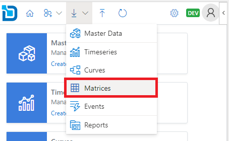

Alternatively, you can click on the **Download** link from the **Matrices** card on the home page.


2.	Search for the matrices you want to download. You can use filters and or the search box to narrow down the search results.

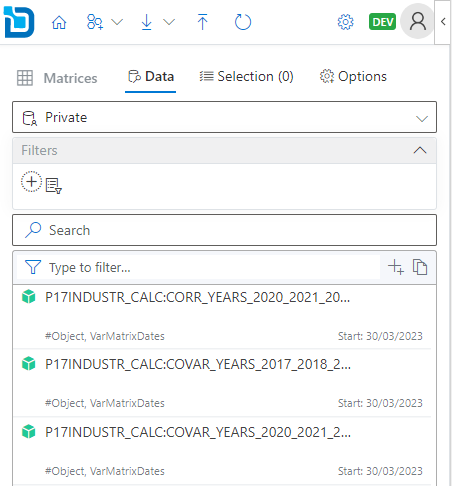

3.	Click the   download icon on each item to download data to the spreadsheet. To add multiple matrices, you can click the   plus icon to add to the selection and then click the **Download** button.

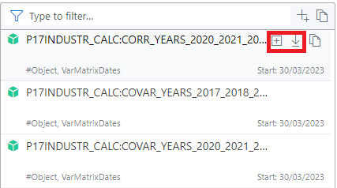

4.	Optionally, before downloading you can select **Ondate** to be displayed from the **Options** tab.

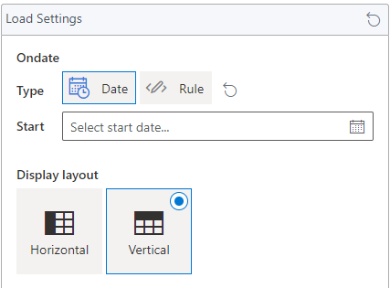

5.	Select the display layout for the matrix on the worksheet.


:::info
#### Horizontal
This option will put the row ids on the first column and column ids in the top row.

#### Vertical
This option will put the column ids on the first row and row ids in the top row.
:::

6.	Click **Download** to download the matrix onto the worksheet.

### Updating existing matrices
1.	From the toolbar select **Upload**.


Alternatively, you can click on the **Upload** link from the **Matrices** card on the home page.


2.	Select the cell range from the available ranges listed from the worksheet.

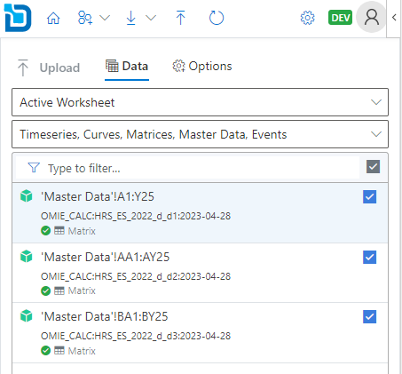

3.	Click the  upload icon to upload the data.
      To update multiple matrices, use the check boxes to toggle on/off from the range items listed and then click **Upload** button.

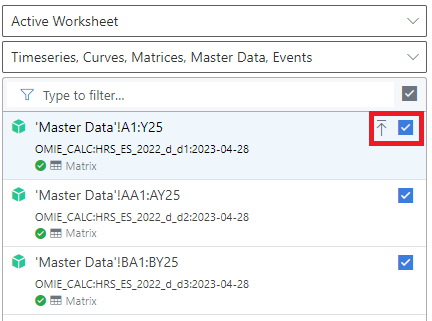

4.	Optionally, before uploading you can specify default settings for new events which are not yet created. This step can be ignored if all the items already exist.

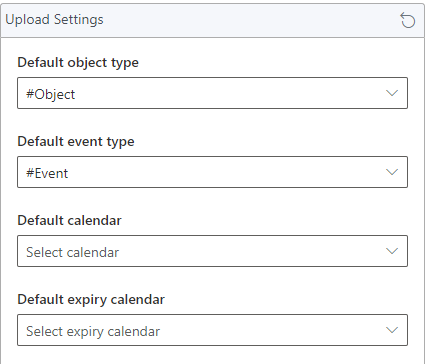

### Refreshing existing matrices

1.	From the toolbar select **Refresh**.


Alternatively, you can click on the **Matrices** link from the **Refresh** card on the home page.


2.	Select the event range from the available ranges listed from the worksheet.

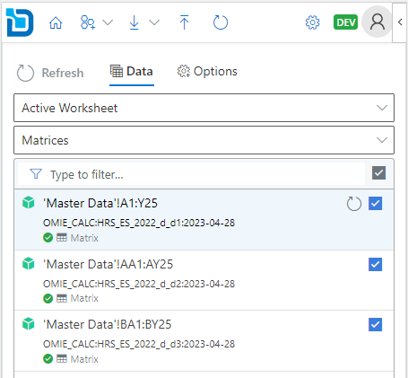

3.	Click the   refresh icon to refresh the data.
      To refresh multiple matrices, use the check boxes to toggle on/off from the range items listed and then click Refresh button.

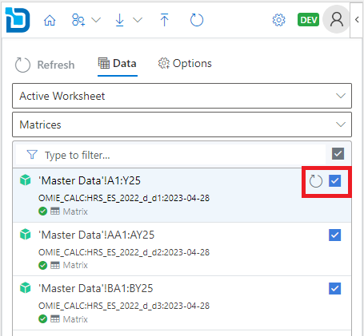

4.	Click **Refresh** to refresh the matrix data on your worksheet.
