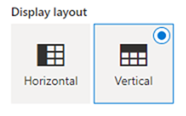
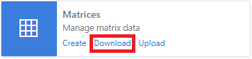
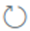

## What are matrices?

Matrices are a table of data with labelled rows and columns

Example:


Example uses of a matrix are:
* A correlation matrix
* A covariance matrix
* A table of statistical information

You have access to all public and your own private data from the Excel Add-in, this document shows you how to find the data you need.

### Creating a new matrix
1.	From the toolbar select **New > Matrices**.


Alternatively, you can click on the Create link from the Matrices card on the home page.


2.	On the new matrix configuration pane select **Object Type**, **Event Type** and specify **Id** for the event being created.

:::info Id Format
The id should include the object id and event id in the format ```<object id>:<event id>```
:::

Additionally, you can specify **Unit** and **Timezone** fields for the event.

:::info Multiple Events
To create multiple events, specify multiple ids separated by comma, space, or semicolon.
:::


3.	Under **Options** you can choose how you want to create the events.


:::info
#### Add only template to worksheet
This option will only add the event layout to the worksheet, but the event is not created.
You need to manually upload the data for the event to get created.

#### Create and add to worksheet
This option will create the event first and upon successful will add the event layout to the worksheet.

#### Create Only
This option will only create the event, it does not add to the worksheet.
You can load the newly created event later from the Downloads section.
:::

4.	Select the display layout for the event on the worksheet.



:::info
#### Horizontal
This option will put the event ids on the first column, properties on the first row and data flows horizontally

#### Vertical
This option will put the event ids on the first row, properties on the first column and data flows vertically.
:::

5.	Click **Create** to create the event based on the configuration.

### Downloading existing events
1.	From the toolbar select **Download > Events**.


Alternatively, you can click on the **Download** link from the **Event** card on the home page.



2.	Search for the events you want to download. You can use filters and or the search box to narrow down the search results.


3.	Click the   download icon on each item to download data to the spreadsheet. To add multiple events, you can click the   plus icon to add to the selection and then click the **Download** button.


4.	Optionally, before downloading you can select **Range**, **Timezone** and the **Properties** to be displayed from the **Options** tab.


5.	Select the display layout for the events on the worksheet.


:::info
#### Horizontal
This option will put the event ids on the first column, properties on the first row and data flows horizontally.

#### Vertical
This option will put the event ids on the first row, properties on the first column and data flows vertically.
:::

6.	Click **Download** to download the events onto the worksheet.


### Updating existing events
1.	From the toolbar select **Upload**.


Alternatively, you can click on the **Upload** link from the **Events** card on the home page.


2.	Select the event range from the available ranges listed from the worksheet.


3.	Click the  upload icon to upload the data.
      To update multiple events, use the check boxes to toggle on/off from the range items listed and then click **Upload** button.


4.	Optionally, before uploading you can specify default settings for new events which are not yet created. This step can be ignored if all the items already exist.


### Refreshing existing events

1.	From the toolbar select **Refresh**.


Alternatively, you can click on the **Events** link from the **Refresh** card on the home page.


2.	Select the event range from the available ranges listed from the worksheet.


3.	Click the   refresh icon to refresh the data.
      To refresh multiple events, use the check boxes to toggle on/off from the range items listed and then click Refresh button.


4.	Click **Refresh** to refresh the event data on your worksheet.
