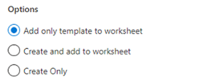
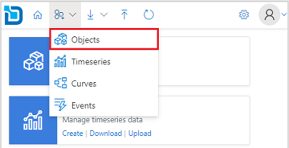
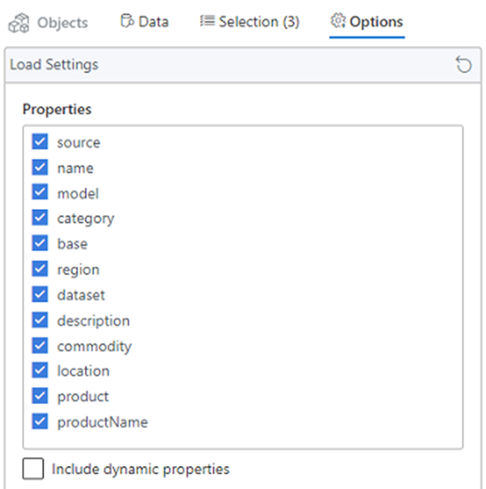
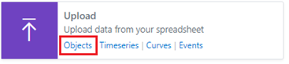
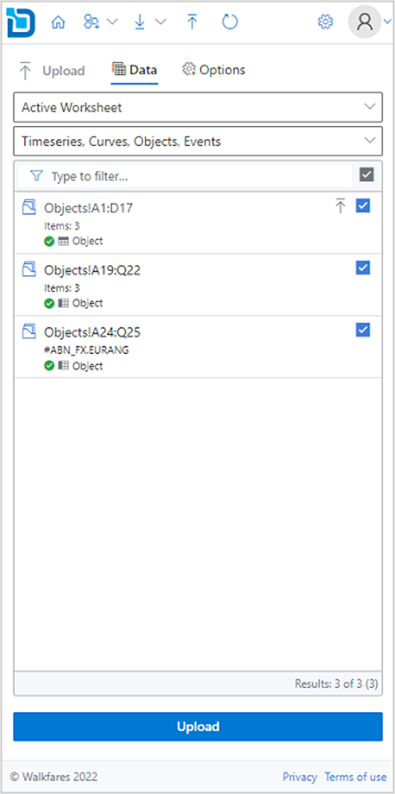
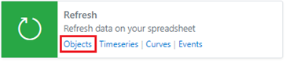
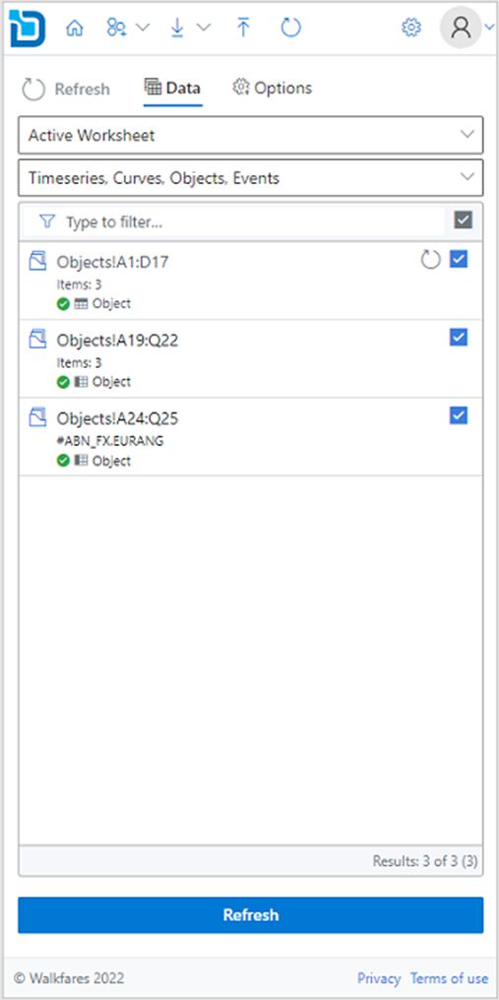
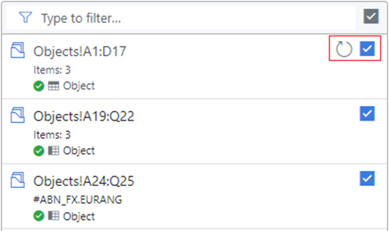

## What are Objects?

Objects are documents in MongoDB

An object is a very versatile variable type that allows you to add any other variables to it including Objects and arrays variable types. 
This creates a dynamic JSON type structure.

### Creating new objects

1.	From the toolbar select **New > Objects**

      

Alternatively, you can click on the **Create** link from the Object card on the home page. 

2.	On the new object configuration pane select Type and specify Id for the object being created. 
To create multiple objects, specify multiple ids separated by comma, space, or semicolon.

3.	Under **Options** you can choose how you want to create the objects.

:::info
#### Add only template to worksheet
This option will only add the object layout to the worksheet along with the properties, but the object is not created. You need to manually upload the data for the objects to get created.

#### Create and add to worksheet
This option will create the objects first and upon successful will add the object layout to the worksheet.

#### Create Only
This option will only create the objects, it does not add to the worksheet. You can load the newly created objects later from the Downloads section.
:::

4.	Select the display layout for the objects on the worksheet.

:::info
#### Horizontal
This option will put the object ids on the first column, properties on the first row and data flows horizontally.

#### Vertical
This option will put the object ids on the first row, properties on the first column and data flows vertically.
:::

5.	Click **Create** to create the objects based on the configuration.

### Downloading existing objects

1.	From the toolbar select **Download > Objects**. 

Alternatively, you can click on the **Download** link from the Object card on the home page. 

2.	Search for the objects you want to download. You can use filters and or the search box to narrow down the search results.

3.	Click the   download icon on each item to download data to the spreadsheet. 
To add multiple objects, you can click the   plus icon to add to the selection and then click the **Download** button.
      
4.	Optionally, before downloading you can select the **Properties** to be displayed from the **Options** tab.

:::note
Customization of properties are allowed only when you have added objects to the selection.
:::

5.	Select the display layout for the objects on the worksheet.

:::info
#### Horizontal
This option will put the object ids on the first column, properties on the first row and data flows horizontally.

#### Vertical
This option will put the object ids on the first row, properties on the first column and data flows vertically.
:::

6.	Click **Download** to download the objects onto the worksheet.

### Updating existing objects

1.	From the toolbar select **Upload**. 
      

Alternatively, you can click on the **Upload** link from the **Object** card on the home page.

2.	Select the object range from the available ranges listed from the worksheet.

3.	Click the  upload icon to upload the data. 
To update multiple objects, use the check boxes to toggle on/off from the range items listed and then click **Upload** button.
      
4.	Optionally, before uploading you can specify default settings for new objects which are not yet created. This step can be ignored if all the items already exist.

5.	Click **Upload** to upload the objects from your worksheet.

### Refreshing existing objects

1.	From the toolbar select **Refresh**. 
      

Alternatively, you can click on the Objects link from the Refresh card on the home page.

2.	Select the object range from the available ranges listed from the worksheet.

3.	Click the   refresh icon to refresh the data. 

To refresh multiple objects, use the check boxes to toggle on/off from the range items listed and then click **Refresh** button.

4.	Click **Refresh** to refresh the object data on your worksheet.

