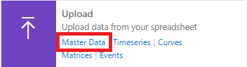

## What is Master Data?

Master data is used throughout the platform to categorise and organise all data
Every timeseries, curve and transaction is interconnected with master data

A Master Data Record is a very versatile variable type that allows you to add any other variables to it including other Master Data and arrays variable types.

:::note
The words **Master Data** and **Object** are interchangeable and refer to the same thing
:::

### Creating new master data records

1.	From the toolbar select **New > Master Data**

   

Alternatively, you can click on the **Create** link from the Master Data card on the home page. 

2.	On the new Master Data configuration pane select Type and specify Id for the data being created. 
To create multiple master data records, specify multiple ids separated by comma, space, or semicolon.

3.	Under **Options** you can choose how you want to create the data.

:::info
#### Add only template to worksheet
This option will only add the master data layout to the worksheet along with the properties, but the data is not created. You need to manually upload the data for the data to get created.

#### Create and add to worksheet
This option will create the master data records first and upon successful will add the data layout to the worksheet.

#### Create Only
This option will only create the master data records, it does not add to the worksheet. You can load the newly created data later from the Downloads section.
:::

4.	Select the display layout for the data on the worksheet.

:::info
#### Horizontal
This option will put the data ids on the first column, properties on the first row and data flows horizontally.

#### Vertical
This option will put the data ids on the first row, properties on the first column and data flows vertically.
:::

5.	Click **Create** to create the data based on the configuration.

### Downloading existing master data records

1.	From the toolbar select **Download > Master Data**. 

Alternatively, you can click on the **Download** link from the Master Data card on the home page. 

2.	Search for the master data you want to download. You can use filters and or the search box to narrow down the search results.

3.	Click the   download icon on each item to download data to the spreadsheet. 
To add multiple data, you can click the   plus icon to add to the selection and then click the **Download** button.
      
4.	Optionally, before downloading you can select the **Properties** to be displayed from the **Options** tab.

:::note
Customization of properties are allowed only when you have added data to the selection.
:::

5.	Select the display layout for the data on the worksheet.

:::info
#### Horizontal
This data will put the object ids on the first column, properties on the first row and data flows horizontally.

#### Vertical
This data will put the object ids on the first row, properties on the first column and data flows vertically.
:::

6.	Click **Download** to download the data onto the worksheet.

### Updating existing master data records

1.	From the toolbar select **Upload**. 
      

Alternatively, you can click on the **Upload** link from the **Master Data** card on the home page.

2.	Select the cell range from the available ranges listed from the worksheet.

3.	Click the  upload icon to upload the data. 
To update multiple items, use the check boxes to toggle on/off from the range items listed and then click **Upload** button.
      
4.	Optionally, before uploading you can specify default settings for new data which are not yet created. This step can be ignored if all the items already exist.

5.	Click **Upload** to upload the objects from your worksheet.

### Refreshing existing master data

1.	From the toolbar select **Refresh**. 
      

Alternatively, you can click on the Master Data link from the Refresh card on the home page.

2.	Select the cell range from the available ranges listed from the worksheet.

3.	Click the   refresh icon to refresh the data. 

To refresh multiple ranges, use the check boxes to toggle on/off from the range items listed and then click **Refresh** button.

4.	Click **Refresh** to refresh the data on your worksheet.

