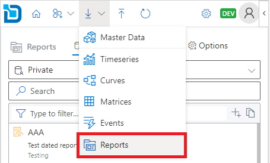
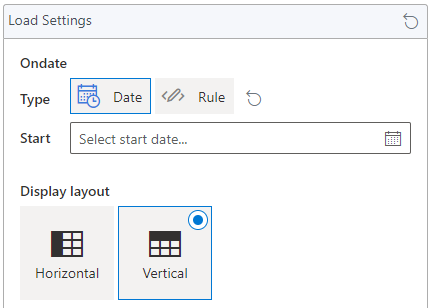
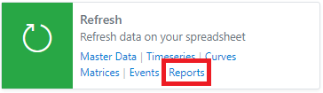
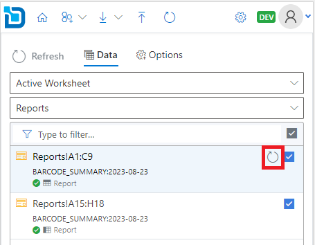
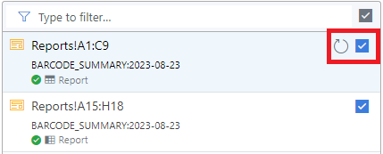

## What are reports?

Reports are a freeform way of aggregating information and displaying it in charts and tables.

Reports have access to, not only the market data, but the system data like usage, processes and audit trails.

:::info
Only reports which are tagged with ```hideExcel = false``` are displayed in the list of reports you can download
:::

### Downloading reports

1.	From the toolbar select **Download > Reports**.



Alternatively, you can click on the **Download** link from the **Reports** card on the home page.


2.	Search for the report you want to download. You can use the search box to narrow down the search results.

3.	Click the   download icon on each item to download data to the spreadsheet.
      To add multiple data, you can click the   plus icon to add to the selection and then click the **Download** button.

4.	Optionally, before downloading you can select the **Ondate** to be displayed from the **Options** tab.



:::note
Ondate selection is available only when you have added data to the selection.
:::

5.	Select the display layout for the report on the worksheet.


:::info
#### Horizontal
This data will put the column headings on the first column and data flows horizontally.

#### Vertical
This data will put the column headings on the first row and data flows vertically.
:::

6.	Click **Download** to download the data onto the worksheet.

### Refreshing existing reports

1.	From the toolbar select **Refresh**.


Alternatively, you can click on the Reports link from the Refresh card on the home page.



2.	Select the cell range from the available ranges listed from the worksheet.



3.	Click the   refresh icon to refresh the data.

To refresh multiple ranges, use the check boxes to toggle on/off from the range items listed and then click **Refresh** button.



4.	Click **Refresh** to refresh the reports on your worksheet.

