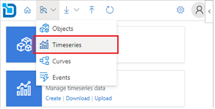
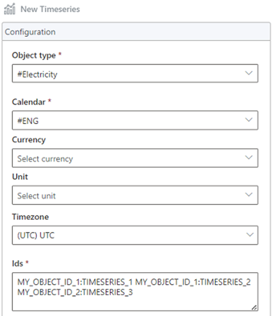
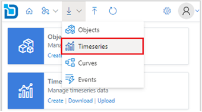
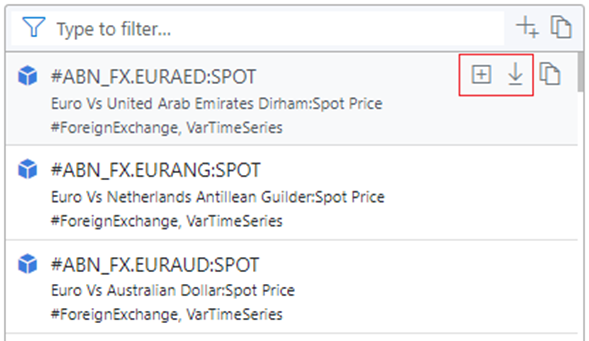
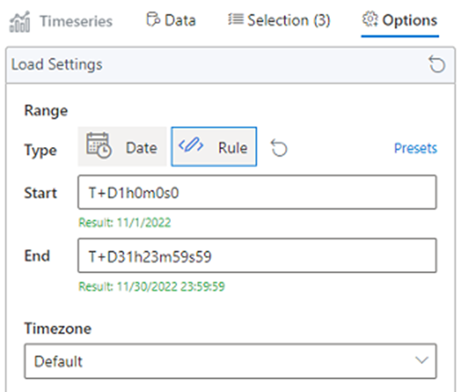
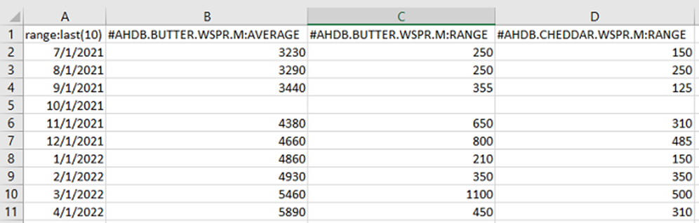
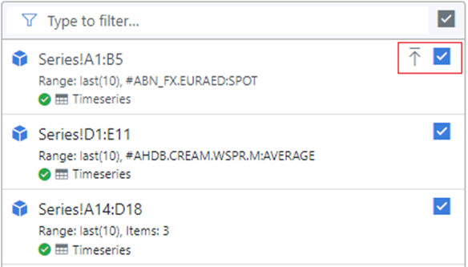
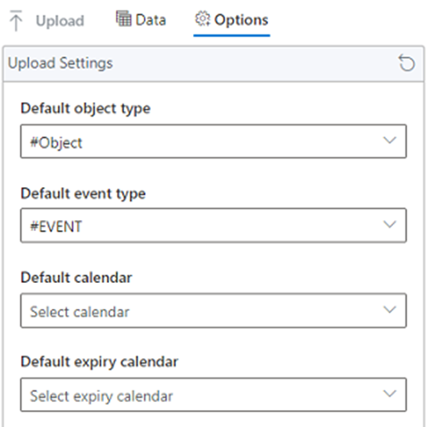
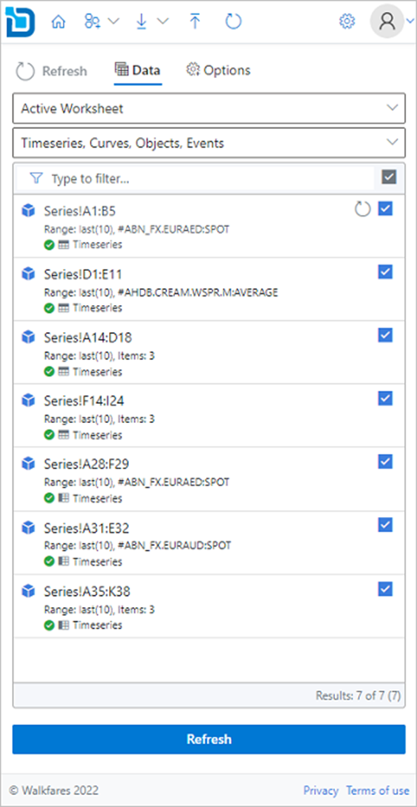
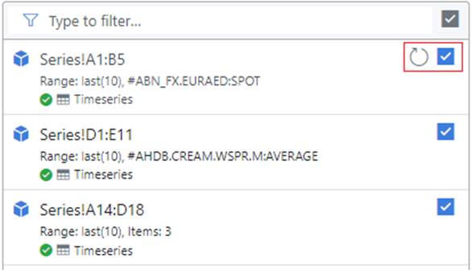

## What are timeseries?
A Timeseries is an array of values where each one is aligned to a point in time. 
Generally, Timeseries are used to record an event or observation at a particular timestamp.

You have access to all public and your own private data from the Excel Add-in, this document shows you how to find the data you need.

### Creating new timeseries

1.	From the toolbar select **New > Timeseries**. 
   
   

Alternatively, you can click on the Create link from the Timeseries card on the home page. 


2.	On the new timeseries configuration pane select **Object Type**, **Calendar**, and specify **Id** for the timeseries being created. 
      
:::info Id Format
The id should include the object id and timeseries id in the format ```<object id>:<timeseries id>```
:::

Additionally, you can specify **Currency**, **Unit**, and **Timezone** fields for the timeseries.

:::info Multiple Timeseries
To create multiple timeseries, specify multiple ids separated by comma, space, or semicolon. 
:::



3.	Under Options you can choose how you want to create the timeseries.


:::info
#### Add only template to worksheet
This option will only add the timeseries layout to the worksheet, but the timeseries is not created. You need to manually upload the data for the timeseries to get created.

#### Create and add to worksheet
This option will create the timeseries first and upon successful will add the timeseries layout to the worksheet.

#### Create Only
This option will only create the timeseries, it does not add to the worksheet. You can load the newly created timeseries later from the Downloads section.
:::

4.	Select the display layout for the timeseries on the worksheet.


:::info
#### Horizontal
This option will put the timeseries ids on the first column, indexes on the first row and data flows horizontally.

#### Vertical
This option will put the timeseries ids on the first row, indexes on the first column and data flows vertically.
:::

5.	Click **Create** to create the timeseries based on the configuration.

### Downloading timeseries

1.	From the toolbar select **Download > Timeseries** 
      


Alternatively, you can click on the Download link from the Timeseries card on the home page. 


2.	Search for the timeseries you want to download. You can use filters and or the search box to narrow down the search results.

3.	Click the  download icon on each item to download data to the spreadsheet. 
      To add multiple timeseries, you can click the  plus icon to add to the selection and then click the Download button.
      


4.	Optionally, before downloading you can select the timeseries **Range** and the **Timezone** to use for the displayed data from the **Options** tab.



5.	Select the display layout for the timeseries on the worksheet.


:::info
#### Horizontal
This option will put the timeseries ids on the first column, indexes on the first row and data flows horizontally.

#### Vertical
This option will put the timeseries ids on the first row, indexes on the first column and data flows vertically.
:::

6.	Click **Download** to download the timeseries onto the worksheet.



### Updating existing timeseries

1.	From the toolbar select **Upload**. 


Alternatively, you can click on the **Upload** link from the **Timeseries** card on the home page.


2.	Select the timeseries range from the available ranges listed from the worksheet.


3.	Click the  upload icon to upload the data. To update multiple timeseries, use the check boxes to toggle on/off from the range items listed and then click **Upload** button.



4.	Optionally, before uploading you can specify default settings for new timeseries which are not yet created. This step can be ignored if all the items already exist.



5.	Click **Upload** to upload the timeseries from your worksheet.

### Refreshing existing timeseries

1.	From the toolbar select **Refresh**. 
      


Alternatively, you can click on the **Timeseries** link from the **Refresh** card on the home page.


2.	Select the timeseries range from the available ranges listed from the worksheet.



3.	Click the   refresh icon to refresh the data. To refresh multiple timeseries, use the check boxes to toggle on/off from the range items listed and then click **Refresh** button.



4.	Click **Refresh** to refresh the timeseries data on your worksheet.

