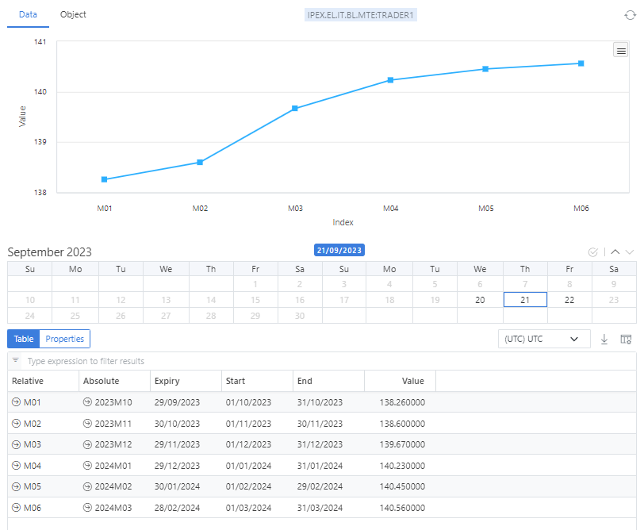

## What is a curve?

A curve is a structure of future values created at a certain point in time.

## What are curves used for?

A curve is used to store:

* The prices that you pay today for a delivery of something in the future 
* A forecast of values, e.g. a weather temperature forecast

## What does a curve look like?

A curve has:
* An *ondate* which is the date at which the curve is created or represents
* A list of tenors representing the future points in time

### Example
This curve has an ondate of the 21st September 2023 and has 6 monthly delivery prices from October 2023 to March 2024

## More information
Some links with further information about curves:

* [Forward Curves](/docs/topics/curves/intro)
* [Tenor Period Codes](/docs/kb/pc)