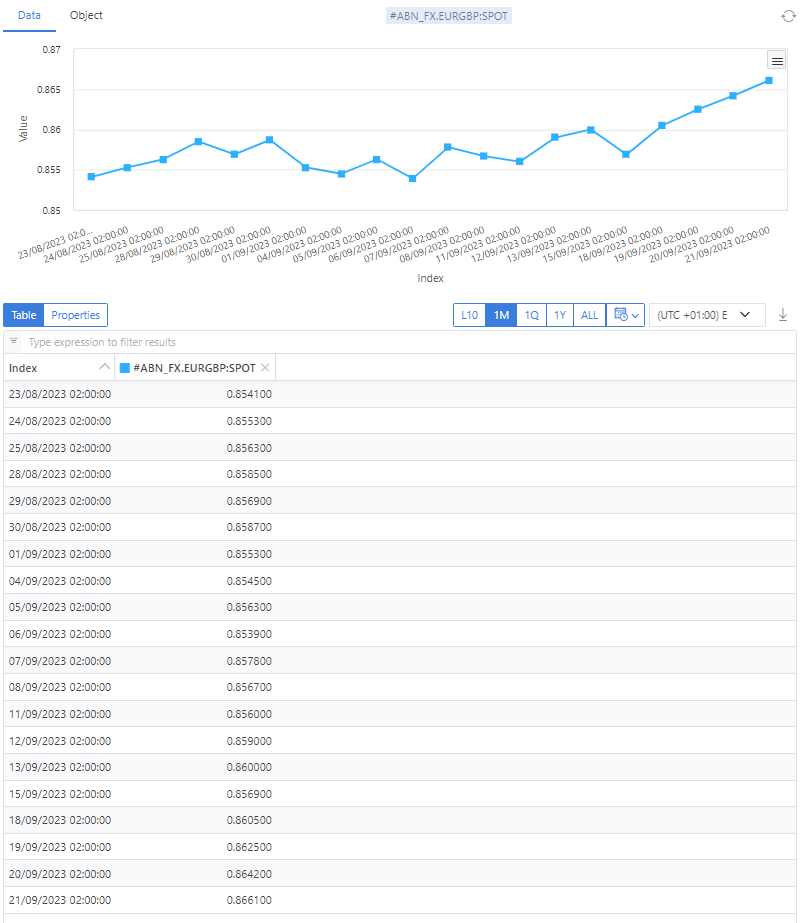

## What is a timeseries?

A timeseries is a list of values where each value represents an observation at a specific point in time.

## What are timeseries used for?

A timeseries is used to record observations or metrics over time, e.g.
* Stock prices
* Sales volumes
* Weather information, such as temperature
* IOT metrics from IOT devices

## What does a timeseries look like?

A timeseries can be plotted on a chart with the x-axis as the timeline and the y-axis as the values.

### Example
This timeseries represents the currency exchange rate for the Euro against UK Pound Sterling over a period of time

