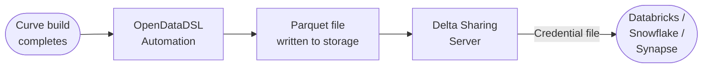

Expose your platform data directly to cloud analytics tools.

:::info
Expected date for MVP: Mid July 2026
:::

## Overview

Cloud Connect is the OpenDataDSL feature that exposes your platform data — validated forward curves, timeseries, and licensed market data — directly to the analytics tools your team already uses, including Databricks, Snowflake, Azure Synapse, Power BI, Tableau, and Python notebooks.

It is built on the open [Delta Sharing protocol](https://delta.io/sharing/), a Linux Foundation standard for secure, live data sharing across organisations and computing platforms. Any tool that implements Delta Sharing connects to your OpenDataDSL data with a single credential file and no custom connectors.

---

## What it does

When a forward curve build completes or a timeseries observation is validated in OpenDataDSL, Cloud Connect automatically serialises that data to Apache Parquet format and writes it to your configured cloud storage — Azure Blob Storage, Azure Data Lake Storage Gen2, or Amazon S3. A Delta Sharing server then exposes those files as queryable tables through a standard REST API.

Your analytics users connect once, receive a credential file, and from that point query your data with standard SQL — exactly as they would any other table in their workspace. Corrections and new data propagate automatically with no action required from the consumer.

---

## Key concepts

### Delta Sharing protocol

Delta Sharing is an open REST protocol that separates metadata (served by the sharing server) from data transfer (downloaded directly from cloud storage via pre-signed URLs). This means data never flows through the OpenDataDSL application tier during a query — transfers go directly from your cloud storage to the client at full bandwidth.

### Shares, schemas, and tables

Data is organised in a three-level hierarchy that maps to the Delta Sharing protocol:

| Level | Description | Example |
|-------|-------------|---------|
| **Share** | A named container issued to a recipient — one per customer or team | `acme-trading` |
| **Schema** | A logical grouping of tables within a share | `forward-curves`, `timeseries`, `reference` |
| **Table** | A Parquet dataset queryable by the recipient | `curves`, `daily`, `curve-catalogue` |

Each recipient receives a unique bearer token scoped to their share. Access is independently revocable and fully audited.

### Hybrid landing and serving layout

Cloud Connect uses a two-zone file layout designed for energy market data patterns:

- **Landing zone** — individual Parquet files written as each curve build completes throughout the day, available immediately for intraday access
- **Serving zone** — consolidated, Hive-partitioned files written at end of day, optimised for analytical queries with date-range partition pruning

Databricks and other query engines push `WHERE ondate = '...'` filters down to the storage layer, reading only the partitions they need.

### Sidecar metadata

Each Parquet file written to the serving zone has a corresponding metadata document stored in MongoDB. This document records the file path, size, row count, curve IDs present, and table version number. The Delta Sharing server reads from these documents rather than enumerating blob storage, making query resolution fast and efficient regardless of how many partitions exist.

---

## Supported tools

Cloud Connect works with any platform that implements the Delta Sharing protocol or can read Apache Parquet files:

| Tool | Connection method |
|------|------------------|
| **Databricks** | Native Delta Sharing via Unity Catalog — upload credential file once in Catalog Explorer |
| **Snowflake** | Apache Iceberg REST Catalog API |
| **Azure Synapse Analytics** | Delta Sharing Spark connector in Spark pools |
| **Apache Spark** | Delta Sharing Spark connector (EMR, Dataproc, and any Spark environment) |
| **Power BI** | Delta Sharing Power BI connector |
| **Tableau** | Delta Sharing Tableau connector (Tableau Exchange, Desktop and Server 2024.1+) |
| **Python / pandas** | `delta-sharing` open-source Python library |
| **Microsoft Excel** | Delta Sharing Excel connector |

---

## What data is available

Cloud Connect exposes two primary data types from your OpenDataDSL platform:

**Forward curves** — one row per `ondate` and `tenor` combination, with columns for `curveId`, `ondate`, `tenor`, `value`, `currency`, and `units`. Both your proprietary built curves and your licensed market data curves are available through the same connection.

**Timeseries** — one row per observation, with columns for `seriesId`, `date`, `value`, `currency`, and `units`. Supports daily, business day, intraday, and custom calendars.

A **reference schema** provides catalogue tables listing all available curves and series, allowing recipients to discover what data they have access to without needing to ask.

---

## Security model

- Each recipient receives a unique bearer token — one token per customer or team
- Tokens are scoped to a specific share so each recipient sees only their licensed data
- All queries are logged for a full audit trail
- Tokens can be individually rotated or revoked with no impact on other recipients
- Data transfer uses cloud provider pre-signed URLs with a short TTL (typically one hour)
- The Delta Sharing server is served over HTTPS

---

## Architecture components

Cloud Connect is implemented across four components, each documented in the following pages:

| Component | Description |
|-----------|-------------|
| **OdslParquetWriter** | Java class that serialises curve and timeseries data to Parquet and writes to Azure Blob Storage, ADLS Gen2, or Amazon S3 |
| **PartitionMetadataRepository** | MongoDB repository storing sidecar metadata for every Parquet file — used by the Delta Sharing server to resolve queries without enumerating storage |
| **DeltaSharingFunctions** | Azure Functions implementation of all nine Delta Sharing protocol REST endpoints |
| **DeltaSharingService** | Service layer that validates bearer tokens, resolves shares and tables, and generates pre-signed URLs for query responses |

---

