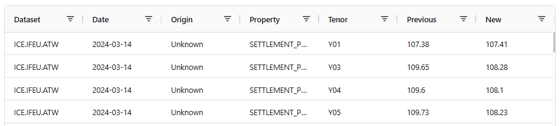
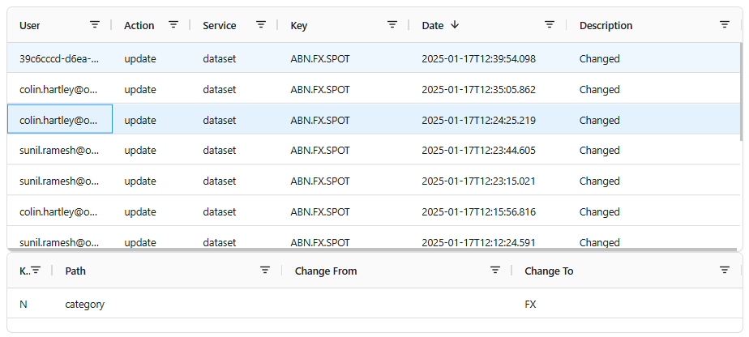
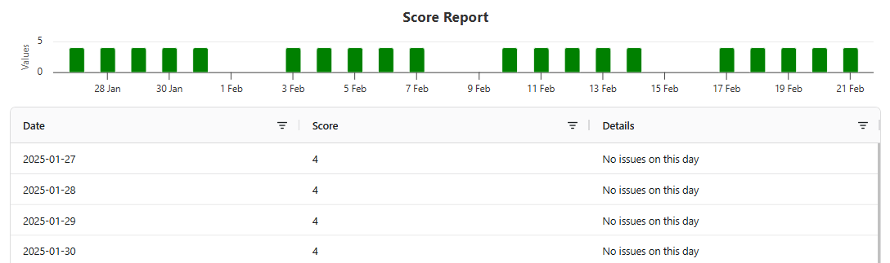

## Introduction

Item insights are shown in an insights menu after selecting a specific item and provide information about the selected item.

## Report Category

The portal uses the **category** of the insight report to determine which menu item to show the report in.
Additional properties are sent to the report with the selected item id.

These are defined in the following table:

|Portal View|Report Category|Properties|
|-|-|-|
|Master Data|Master Data Insights|ID = object _id|
|Data|Data Insights|ID = data _id excluding the ondate|
|Events|Event Insights|ID = event id|
|Curves|Curve Management Insights|ID = curve _id + ONDATE = selected ondate|
|Datasets|Dataset Monitoring Insights|DSID = dataset id + ONDATE = selected ondate|
|Processes|Process Insights|ID = process _id|
|Executions|Process Insights|ID = process _id, EXECID = execution _id|
|Queues|Queue Insights|ID = queue _id|
|Types|Type Insights|ID = type _id|
|Calendars|Calendar Insights|ID = calendar _id|
|Scripts|Script Insights|ID = script _id|
|Alerts|Alert Insights|ID = alert _id|

## Creating Insights
We have created a few pre-defined template functions based on the layout of the insight report:

* **singleTableReport**
  > A single table showing the data from a query.
* **masterDetailTableReport**
  > 2 tables showing master data and selected detailed data. 
* **chartTableReport**
  > A chart and a table for data.

:::note
Just place ```{{> #insight }}``` at the top of your mustache script to use one of them
:::

### singleTableReport
A single table report takes the following configuration object:

| Property | Type | Example | Description |
|-|-|-|-|
|service|String|calendar|The name of the service to get the data from|
|source|String|private|The source of the data|
|filter|Object|{'dsid': ReportProperties().DSID}|A filter to be applied to the query|
|columnDefs|Array(Object)|See columnDefs below|An array of column definitions for the table|
|inputs|Array(Input)|See Inputs below|A list of optional inputs to all the user to select from|
|dataCallback|Function|getData|An optional callback function that allows you to override the requesting and formatting of the data sent back to Excel|
|rangeSelector|Object|See rangeSelector below|An optional range selector configuration to allow the user to select a range of dates|

### masterDetailTableReport
A single table report takes the following configuration object:

| Property | Type | Example | Description |
|-|-|-|-|
|service|String|calendar|The name of the service to get the data from|
|source|String|private|The source of the data|
|filter|Object|{'dsid': ReportProperties().DSID}|A filter to be applied to the query|
|columnDefs|Array(Object)|See columnDefs below|An array of column definitions for the table|
|detailColumnDefs|Array(Object)|See columnDefs below|An array of column definitions for the detail table|
|inputs|Array(Input)|See Inputs below|A list of optional inputs to all the user to select from|
|dataCallback|Function|getData|An optional callback function that allows you to override the requesting and formatting of the data sent back to Excel|
|rangeSelector|Object|See rangeSelector below|An optional range selector configuration to allow the user to select a range of dates|

### chartTableReport
A single table report takes the following configuration object:

| Property | Type | Example | Description |
|-|-|-|-|
|service|String|calendar|The name of the service to get the data from|
|source|String|private|The source of the data|
|filter|Object|{'dsid': ReportProperties().DSID}|A filter to be applied to the query|
|columnDefs|Array(Object)|See columnDefs below|An array of column definitions for the table|
|inputs|Array(Input)|See Inputs below|A list of optional inputs to all the user to select from|
|dataCallback|Function|getData|An optional callback function that allows you to override the requesting and formatting of the data sent back to Excel|
|rangeSelector|Object|See rangeSelector below|An optional range selector configuration to allow the user to select a range of dates|
|projection|Object|{ondate:true, score:true, scoreinfo:true}|A projection for fields to show in the chart|
|chartDefinition|Object|See chartDefinition below|The definition of the chart|

### Inputs Configuration

| Property | Type | Example | Description |
|-|-|-|-|
|type|String|select|The type of input, can be one of (select,text,date,datetime,integer,check)|
|name|String|Tenor Type|The label to use for the input|
|help|String|'Select something'|Help text to display to the user|
|field|String|_id|The name of the field that will be used in the filter|

For **select** type fields, there are also the following properties:

| Property | Type | Example | Description |
|-|-|-|-|
|data|Array(String)|['test1','test2']|An optional list of items to display in the drop-down list. If not used, the system will get a distinct list of items using the field name|
|service|String|calendar|The service to use to get the items for the drop-down list, defaults to the top-level service|
|source|String|private|The source to use for the items in the drop-down list, defaults to the top-level source|
|filter|Object|{category='test'}|An optional filter to use to get the items for the drop-down list|
|multiple|Boolean|true|If true, allows multiple selections to be made|
|selectAll|Boolean|true|If this is a multiple selector, this adds an optional 'Select All' option|

### rangeSelector Configuration

| Property | Type | Example | Description |
|-|-|-|-|
|includeTime|Boolean|false|Allow the user to select times as well as dates|
|timestampField|String|timestamp|The name of the field containing the dates to filter on, defaults to timestamp|
|ranges|Array(String)|['thisyear','nextyear']|Optional list of preset ranges to provide to the user|
|defaultRange|String|thisyear|The default range to select from the list|

#### Selectable ranges

The following table lists the range names that can be used in the **ranges** array:

|name|description|
|-|-|
|yesterday|1 calendar day back from today|
|today|Today|
|lastmonth|The full previous calendar month|
|thismonth|The full current calendar month|
|nextmonth|The full next calendar month|
|lastyear|The full previous calendar year|
|thisyear|The full current calendar year|
|nextyear|The full next calendar year|
|last*n*|The last n calendar days, e.g. last7|
|next*n*|The next n calendar dayes, e.g. next7|

## Examples

### Example singleTableReport
The following example shows data corrections for a selected DSID.



Here is the mustache file configuring the insight report:

```js
{{> #insight }}

<script>
singleTableReport({
	rangeSelector: {
		includeTime : true,
		timestampField: 'timestamp'
	},
	source: 'all',
	service: 'correction',
	filter: {'dsid': ReportProperties().DSID},
	columnDefs: [
		{field: 'dsid', headerName: 'Dataset'},
		{field: 'ondate', headerName: 'Date'},
		{field: 'origin', headerName: 'Origin'},
		{field: 'property', headerName: 'Property'},
		{field: 'tenor', headerName: 'Tenor'},
		{field: 'previous', headerName: 'Previous'},
		{field: 'new', headerName: 'New'}
	]
});
</script>
```

Here is the configuration of the report itself:

```js
ir = InsightReport()
ir.id = "DMI_CORRECTIONS"
ir.name = "Corrections"
ir.description = "Corrections Reports"

ir.category = "Dataset Monitoring Insights" // This tells Dataset Monitoring to add it to the list of Insights
ir.template = "insight-ds-corrections"  // The name of the mustache file
ir.icon = "bookmark-check" // The icon to use from https://icons.getbootstrap.com/
ir.hideList = true // Don't show this report in the portal report list
ir.hideExcel = true // Don't show this report in the reports menu in Excel
save ir
```

### Example masterDetailTableReport
The following example shows audit records for a selected DSID (both dataset and dataset feed).



Here is the mustache file configuring the insight report:

```js
{{> #insight }}

<script>
let dsid = ReportProperties().DSID;
let parts = dsid.split(".");
let dsf = parts[0] + "." + parts[1];
let filter = {"$or":[{"service":"dataset_feed","key":dsf},{"service":"dataset","key":dsid}]};

masterDetailTableReport({
	rangeSelector: {
		includeTime : true,
		timestampField: 'timestamp'
	},
	source: 'private',
	service: 'audit',
	filter: filter,
	columnDefs: [
		{field: "user", headerName: "User", width:120},
		{field: "action", headerName: "Action", width:90},
		{field: "service", headerName: "Service", width:100},
		{field: "key", headerName: "Key", width:150},
		{field: "timestamp", valueParser: params => Date(params.oldValue), sort: 'desc', headerName: "Date", width:180},
		{field: "description", headerName: "Description"}
	],
	detailColumnDefs: [
		{field: "kind", headerName: "Kind", width:40},
		{field: "path", headerName: "Path"},
		{field: "lhs", headerName: "Change From"},
		{field: "rhs", headerName: "Change To"},
	]
});
</script>
```

Here is the configuration of the report itself:

```js
ir = InsightReport()
ir.id = "DMI_AUDIT"
ir.name = "Audit Report"
ir.description = "Audit Report"

ir.category = "Dataset Monitoring Insights" // This tells Dataset Monitoring to add it to the list of Insights
ir.template = "insight-ds-audit"  // The name of the mustache file
ir.icon = "body-text" // The icon to use from https://icons.getbootstrap.com/
ir.hideList = true // Don't show this report in the portal report list
ir.hideExcel = true // Don't show this report in the reports menu in Excel
save ir
```

### Example chartTableReport
The following example shows data delivery scores for a selected DSID.



Here is the mustache file configuring the insight report:

```js
{{> #insight }}

<script>
chartTableReport({
	rangeSelector: {
		includeTime : false,
		timestampField: 'ondate',
		ranges: ["last7", "last30", "last60", "thismonth", "lastmonth", "all"],
		defaultRange: "last30"
	},
	service: 'dataset_delivery',
	filter: {dsid:ReportProperties().DSID, 'score':{'$ne':0}},
	projection: {ondate:true, score:true, scoreinfo:true},
	columnDefs: [
		{field: 'ondate', headerName: 'Date'},
		{field: 'score', headerName: 'Score'},
		{field: 'scoreinfo', headerName: 'Details'}
	],
	chartDefinition: {
		credits: {
            enabled: false
        },        
        chart: {
            type: 'column'
        },
        title: {text:"Score Report"},
        legend:{enabled:false},
        xAxis: {
            type: 'datetime'
        },
        yAxis: {
            allowDecimals: false
        },
        series: [
			{
				name:"Scores",
				data:[],
				zones: [{
					value: 4,
					color: 'red'
				}, {
					color: 'green'
				}]
			},
		]
	},
	chartX: 'ondate',
	chartY: 'score'
})
</script>
```

Here is the configuration of the report itself:

```js
ir = InsightReport()
ir.id = "DMI_SCORES"
ir.name = "Score Report"
ir.description = "Delivery Score Report"

ir.category = "Dataset Monitoring Insights" // This tells Dataset Monitoring to add it to the list of Insights
ir.template = "insight-ds-scores"  // The name of the mustache file
ir.icon = "bar-chart-steps" // The icon to use from https://icons.getbootstrap.com/
ir.hideList = true // Don't show this report in the portal report list
ir.hideExcel = true // Don't show this report in the reports menu in Excel
save ir
```

