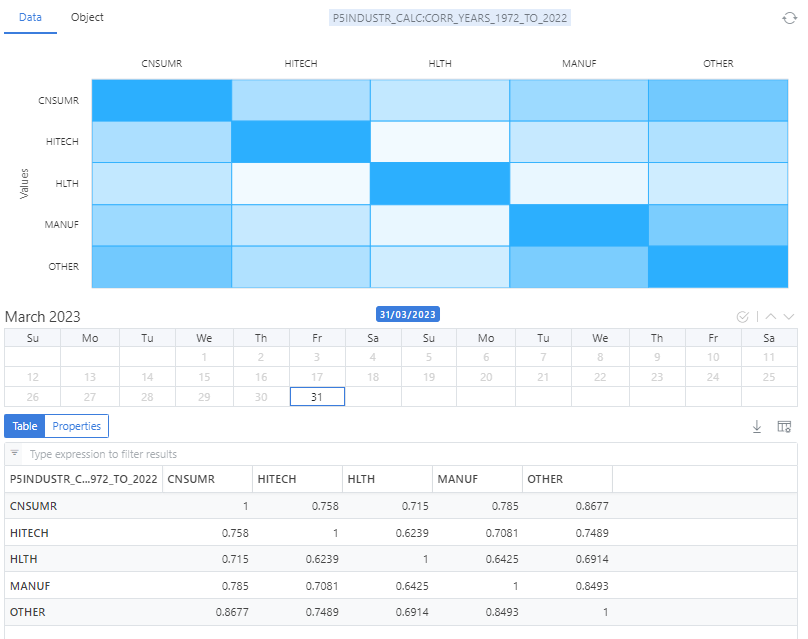

Matrix handling in OpenDataDSL

## What is a matrix?
A matrix is a rectangular array of numbers, arranged in rows and columns. 
In mathematics, matrices are widely used to represent linear transformations, to solve systems of linear equations, and for many other applications. 
Matrices are often denoted by capital letters and the elements of a matrix are referred to by lowercase letters with subscripts, for example, A_{ij} refers to the element in the i-th row and j-th column of matrix A.

## What are matrices used for?

Matrices are typically used to store:
* Correlations
* Covariances
* Options
* Implied Volatilities

## What does a matrix look like?

A matrix has:
* An *ondate* which is the date at which the matrix is created or represents
* A table of values

### Example
This matrix has an ondate of the 31st March 2023 and represents a correlation matrix for 5 industries.

## More information
Some links with further information about matrices:

* [Matrix variable in ODSL](/docs/odsl/variable/matrix)
* [Matrix functions](/docs/odsl/function/matrix)