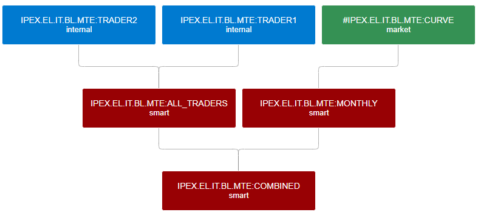

Curve Management
=============

This guide explains how to effectively manage forward curves within OpenDataDSL.

## Curve Types
There are 3 types of curves in OpenDataDSL which are designated by how they are created and where the data originates from.

* **Market Curves**
  > These are market provided curves and can generally be seen as raw, but reliable curves.
* **Internal Curves**
  > These are internally provided curves from traders or analysts.
* **Smart Curves**
  > These are curves that are derived using your own custom logic

## Curve Dependencies
There is a natural hierarchy of curves which is defined by the inputs or curve dependencies and potential curve dependents.

### Example
In the diagram below, we see that:
* The smart **ALL_TRADERS** curve is built from 2 internal curves; **TRADER1** and **TRADER2**.
* The smart **MONTHLY** curve is built from the market **CURVE** curve.
* The **ALL_TRADERS** and **MONTHLY** curves then become inputs into the **COMBINED** curve.

### Visualising the hierarchy
It is important to understand the relationships between curves especially when things stop working.
The ability to easily traverse through the curve family tree aids failure diagnosis and reparations.

## Curve Dashboard
The curve dashboard has a few fundamental purposes which are explained in the section.

### Curve monitoring
For end-of-day curves, monitoring of curves is focussed on a specific day, usually the previous working day.

#### Curve status
For each day that a curve needs to be built, it has a status which reflects the health of the curve.

* Initially, a curve is in a **Waiting** state.
* When it has all the data it requires in order to built, then it progresses to either a **Built** or a **Failed** state.
* If it builds successfully and there is validation configured for it, then it will progress from there to either a **Complete** or **Invalid** state. 

#### Curve status flow:

#### Curve status additional information

With each status, there is additional contextual information as shown in the table below:

|**Status**|**Additional Context**|
|-|-|
|**Waiting**|Information about which input(s) the curve is waiting for|
|**Built**|Any log information or warnings provided by the build process|
|**Failed**|Error information about why the build failed in order to rectify it|
|**Invalid**|Information about the build process, what checks were performed and which ones failed|
|**Complete**|Information about the build process and the validations performed|

### Build failure investigation
Inevitably, curves occasionally fail to build, so this prompts an investigation into why the curve didn't build and what can be done to prevent it happening again.

This section details the tools and information we provide to help with this investigation.

#### Failure message
The error information context displayed in the failed curve version gives you the actual reason for failure which may be able to pinpoint how to fix it.

#### Build log
The next stage of investigation is the build log, these are information, warning and error messages which your custom build script can output which will allow you to trace through the build code.  

#### Audit log
The final stage of investigation is to use audit records which may show further error information outside of the actual build process.

### Curve insights and analytic reports
There are a number of predefined insights and reports which can help you gain a deeper understanding of your curves.

#### Popularity/Usage
The popularity insight highlights the most actively read curves by your users and systems, this helps to understand the overall usage of your curves. 

This report is a *drill-down* report with 3 levels of reporting: commodity, market and curve, e.g.

#### Management
The management report provides some fundamental information about your curve universe which is extremely useful for answering questions from new users, such as:
* Which commodities do we cover?
* Which markets of a specific commodity do we cover?
* How must history do we have for a specific curve or market?

#### Build statistics
The build statistics report provides an aggregated build performance chart enabling you to:
* Direct resources onto improving the reliability of problematic curves.
* Easily see if overall build reliability is improving or degrading.

This report is a *drill-down* report with 3 levels of reporting: commodity, market and curve, e.g.

## Curve Contingency
Curve contingency is a process that deals with situations where a curve is not created when we expect it to be or the structure of a curve that has been created is incorrect.

### Issues fixed by curve contingency

#### Curves not built
There are various reasons why a curve is not created or is not created correctly for a specific day.

* **Missing Data**
    > A curve generally requires input data, usually from prices sources or other curves. If this is not available, then we cannot build the curve.
* **Partial or Badly Structured Data**
    > If the input data for a curve is not complete or has tenors which are not handled in the curve logic, this could create a bad curve or cause an exception.
* **Bad Curve Logic**
    > If the code to build the curve has an error, this could build a bad curve or throw an exception.

#### Incorrect curve structure
Generally, forward curves will be fed into a downstream system that would expect the curve to conform to a certain structure.
Part of curve contingency is to ensure that the curves we create conform to pre-defined rules regarding the type and number of tenors contained in the curve.

