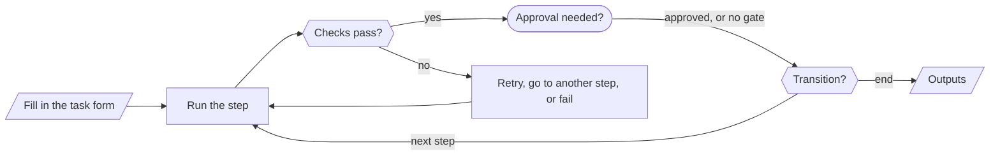

# What are AI Playbooks?

A **Fusion AI Playbook** is a written description of one job, such as checking this morning's forward curves, onboarding a new dataset or building the month-end market summary, that Fusion AI can carry out for you step by step, the same way every time.

You write the playbook once, in markdown. It says:

- **What the person running it fills in**: the curves, the dataset, the month, the people to email
- **The steps, in order**: what each step must do, in plain language, and the tools it may use
- **The checks** each step's result must pass before the run moves on
- **Where a person approves** before anything on the platform changes
- **What the run hands back**: a report, a script, a summary, a count

Fusion turns the playbook into a simple form. Anyone on your team fills it in and presses **Run**, and Fusion works through the steps on your platform data, exactly as written, keeping a full record of every step, check and approval.

---

## Why use a playbook rather than a chat?

A chat with Fusion AI is ideal for questions and one-off work. Some jobs, though, are repeated again and again and have a right way to be done. Asking for them in a chat each time has drawbacks:

| In a chat | In a playbook |
|-|-|
| Ask twice and you may get two different approaches | The playbook sets the order of the steps and the tools each step may use |
| The quality depends on how well the question is asked | The instructions are written once by the person who knows the job best |
| Nothing checks the answer unless you do | Each step is checked against rules you write, and retried if it falls short |
| Changes happen when you confirm them in the conversation | The run stops at an approval gate, and named approvers are emailed |
| The record is the conversation | Every run records each step's result, every check, every approval and the tokens used |
| You need to be there | Runs can carry on in the background or run on a schedule |

---

## How a playbook runs

When you run a playbook, Fusion follows it one step at a time:

- **Focused steps**: Fusion works only on the current step, with only that step's tools plus a few read-only ones. A step that reads curves cannot save a script.
- **Structured results**: each step records the values it was asked to produce, such as a script, a table or a count. Later steps and checks use these values.
- **Checks**: rules such as "every curve was found" or "the script validates" are verified after the step. If a check fails, Fusion tries again and is told why, jumps to another step, or the run stops.
- **Transitions**: rules such as "if nothing is wrong, end here" choose the next step.
- **Gates**: the run pauses for a person to approve or reject, typically before something is saved, created, run or sent.
- **Budgets**: each run has a token cap, and runs respect your tenant's Fusion AI budget and limit.

---

## Where you find playbooks

Playbooks live in the **Fusion AI** extension in the portal:

| Where | What you do there |
|-|-|
| **Playbooks** tab, **Library** | Browse the OpenDataDSL library of ready-made playbooks. Run one as it is, or copy it to make it your own. |
| **Playbooks** tab, **My playbooks** | Write and edit your tenant's own playbooks, including any added by an extension. Draft a playbook from a description with Fusion. |
| **Tasks** tab | Fill in a task from a playbook and run it, in the page or in the background, or give it a schedule. Approve or reject runs waiting at a gate. |
| **Studio** (the chat) | Ask Fusion to run a playbook. It fills in a task from the conversation and shows it as a card you can run. |
| **Fusion AI Playbook Runs** insight | See runs by playbook and user, success rates, failures and their reasons, and tokens per run. |

---

## Key terms

| Term | Meaning |
|-|-|
| **Playbook** | The markdown document describing the job. Every save creates a new version. |
| **Task** | One use of a playbook: the values filled in on the form, tied to the playbook version it was created from. |
| **Run** | The execution of a task: the state of each step, its results, checks, approvals and tokens. One task has one run; clone a task to run it again. |
| **Step** | One unit of work in the playbook, carried out by a Fusion assistant with a set of tools. |
| **Check** | A rule verified after a step completes. |
| **Gate** | An approval point after a step. |
| **Transition** | A rule that chooses which step comes next. |
| **Output** | A value the run hands back when it finishes. |

---

## Next steps

- [Creating playbooks](/docs/topics/fusion-ai-playbooks/creating): the ways to write a playbook and the editor
- [Playbook syntax](/docs/topics/fusion-ai-playbooks/syntax): the full reference for the playbook format
- [Running playbook tasks](/docs/topics/fusion-ai-playbooks/running): forms, background runs, schedules and approvals
