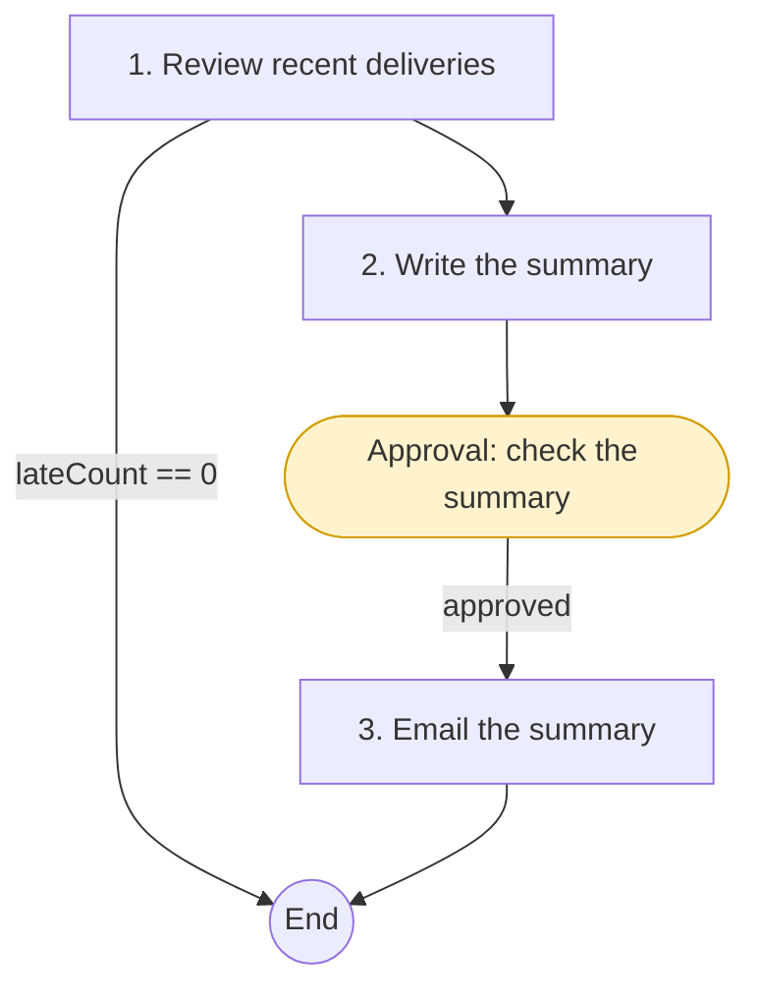

# Creating playbooks

There are four ways to create a playbook. They all end in the same place: a markdown document in **My playbooks** that you can edit, check, preview and save.

| Start from | Best when |
|-|-|
| **Draft with Fusion** | You know the job but not the syntax. Describe it in a sentence or two. |
| **A library playbook** | OpenDataDSL already has a playbook close to what you need. |
| **Start from an example** | You want a small working playbook to learn from. |
| **New playbook** or **Upload** | You know the format, or you keep playbooks as `.md` files in source control. |

All of these are on the **Playbooks** tab of the **Fusion AI** extension.

---

## Draft with Fusion

The quickest way to start is to describe the job and let Fusion write the playbook.

1. Open **Playbooks**, then **My playbooks**, and select **Draft with Fusion**.
2. Describe the job. Say what the person running it should fill in, what should happen and in what order, what must be true before the run moves on, and where someone should approve.
3. Fusion writes the playbook, checks it against the format as it goes, and opens it in the editor.
4. Read it through, adjust the instructions to match how your team works, and **Save**.

A good description reads like the brief you would give a new colleague:

> Check the latest version of a set of curves the user lists. For each curve, flag day-on-day moves above a percentage the user chooses, missing tenors and zero or negative prices. If nothing is wrong, stop there. Otherwise raise one alert per curve with problems, after someone in the Data Ops group approves.

To change an existing playbook the same way, open it and select **Revise with Fusion**, then say what to change, for example "add a step that emails the findings to the person running it".

:::tip
Fusion drafts are a starting point. The instructions in each step are what Fusion follows on every run, so it is worth making them as precise as you would for a person: what to look at, what counts as a problem, and exactly which values to record.
:::

---

## Copy a library playbook

The **Library** tab shows the OpenDataDSL playbooks, grouped by category with featured playbooks first. Open a playbook to see what it does, its plan as a flow diagram, the values you will be asked for, the tools it uses and its versions.

- **New task** runs the library playbook as it is. You do not need a copy to use it.
- **Copy to my playbooks** creates your own copy to customise.

A copy remembers which library version it came from. When OpenDataDSL improves the library playbook, your copy shows a notice with **Compare**, so you can see what changed in the library and bring across what you want. **Mark as up to date** clears the notice.

---

## Start from an example, or write it yourself

**Start from an example** opens a small, complete playbook that reads some data, drafts a report and saves it. It is a good way to see every kind of block working together.

**New playbook** opens an empty editor with the front matter in place. **Upload** loads a `.md` file, and **Download** saves the current playbook as one, so you can keep playbooks in source control and share them between tenants.

The full format is described in [Playbook syntax](/docs/topics/fusion-ai-playbooks/syntax).

---

## The playbook editor

The editor has these tabs:

| Tab | What it shows |
|-|-|
| **Edit** | The markdown source |
| **Preview** | The playbook rendered as a document, with each block shown as a card |
| **Diagram** | The playbook as a flow diagram: steps, checks, approval gates and transitions. **Copy Mermaid** copies the diagram source. |
| **Versions** | Every saved version, with a line-by-line comparison between any two |

As you type, the playbook is checked and any problems are listed with their line numbers:

- **Errors** stop a playbook from being saved or run, for example a step with no instructions, an input with an unknown type, or a reference to a step that does not exist.
- **Warnings** are allowed but worth reading, for example a step that can change the platform with no approval gate before it, or a reference to a value the step does not list in `produces`.

Every save creates a new version. A task records the version it was created from, so editing a playbook never changes a task that has already been filled in or run.

---

## A first playbook

Here is a small but complete playbook. It looks at a dataset's recent deliveries, stops if everything is on time, and otherwise writes a summary and emails it after approval.

````markdown
---
id: dataset-delivery-summary
name: Dataset delivery summary
category: Datasets
assistant: Operations
description: Summarises late or incomplete deliveries for a dataset and emails the summary
---

Look at deliveries in the dataset's own timezone and calendar. A delivery is late
when it arrives after the time the dataset expects it.

```input
name: dataset
label: Dataset
type: dataset
required: true
```

```input
name: recipients
label: Email the summary to
type: text
required: true
help: Email addresses, separated by commas
```

```step
id: review
title: Review recent deliveries
tools: [find_datasets, find_dataset_deliveries]
instructions: >
  Look at the last 10 business days of deliveries for @{input.dataset}.
  Set lateCount to the number of late or incomplete deliveries and table
  to a markdown table of date, expected time, actual time and status.
produces: [lateCount, table]
```

```transition
from: review
when: "@{steps.review.lateCount} == 0"
to: end
```

```step
id: summarise
title: Write the summary
instructions: >
  Write a short summary of these late deliveries for an operations audience:
  @{steps.review.table}
produces: [summary]
```

```gate
after: summarise
message: Check the summary before it is emailed
```

```step
id: send
title: Email the summary
tools: [send_email]
instructions: >
  Email @{steps.summarise.summary} to @{input.recipients} with the subject
  "Delivery summary for @{input.dataset}".
produces: [sentTo]
```

```output
name: summary
type: text
from: steps.summarise.summary
```
````

The editor's **Diagram** tab draws it like this:



When you save it, select **New task** to fill in the form and run it. See [Running playbook tasks](/docs/topics/fusion-ai-playbooks/running).

---

## Tips for good playbooks

- **One job per playbook.** A playbook that does one thing well is easier to check, approve and reuse than one that does several.
- **Write the guidance once, in the prose.** House style, naming conventions and what good looks like belong in the prose at the top, which Fusion reads at the start of every run. Keep step instructions about the step.
- **Ask each step for named values.** A step's `produces` list is the contract with later steps, checks and transitions. Say in the instructions exactly what each value should contain, for example "a markdown table of curve, tenor and reason" or "the number of problems found".
- **Check what matters.** A check is a second look at the step's result. Use checks for things that are easy to get wrong: every item was covered, the script validates, the numbers match the source.
- **End early when there is nothing to do.** A transition to `end` when a step finds nothing keeps runs short and cheap, which matters for scheduled tasks.
- **Gate anything that changes the platform.** Put a gate before steps that save, create, run, raise or send anything. The editor warns you when you do not.
- **Give the right assistant to each step.** Use the **Code** assistant for scripts, **Curve** for curve work, **Analyst** for data analysis and **Operations** for processes and deliveries.
- **Do not put secrets in a playbook.** Playbooks are visible to everyone who can read them, and so are the values filled in on tasks.
