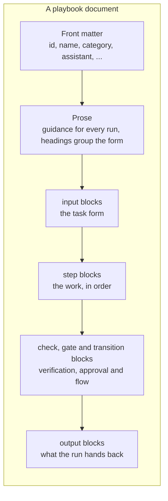

# Playbook syntax

A playbook is a markdown document with three parts:

1. **Front matter** between `---` lines at the top: the playbook's id, name and settings
2. **Prose**: ordinary markdown that guides Fusion on every run
3. **Marker blocks**: fenced code blocks whose language is `input`, `step`, `check`, `gate`, `transition` or `output`, holding YAML that the playbook engine reads



Blocks can appear in any order and can be mixed with the prose. Steps run in the order they appear in the document unless a transition says otherwise, so it reads best to put each check, gate and transition just after the step it belongs to.

This page covers the front matter, prose, inputs, steps, outputs and references. Checks, gates, transitions and conditions are covered in [Checks, gates and transitions](/docs/topics/fusion-ai-playbooks/flow).

---

## Front matter

The front matter is YAML between two `---` lines at the very top of the document.

```yaml
---
id: curve-quality-check
name: Curve quality check
category: Curves
assistant: Curve
description: Checks forward curves for big moves, missing tenors and bad prices
icon: shield-check text-success
tags: [curves, quality, alerts]
maxTokens: 1000000
---
```

| Field | Required | Description |
|-|-|-|
| `id` | Yes | The playbook's unique id. Letters, numbers, `.`, `-` and `_`. OpenDataDSL library playbooks start with `#`. Quote the id, because `#` otherwise starts a YAML comment: `id: '#curve-quality-check'`. |
| `name` | Yes | The name shown in the library, on tasks and in reports. |
| `category` | No | Groups playbooks in the library and in lists, for example `Curves`, `Datasets`, `Reports`. |
| `assistant` | No | The Fusion assistant used for steps that do not choose their own: `General`, `Analyst`, `Code`, `Curve`, `Integrate`, `Operations`, or the name of one of your custom assistants. |
| `description` | No | One line on what the playbook does. Shown on library cards and given to Fusion when it looks for a playbook to run from the chat. |
| `icon` | No | A Bootstrap icon name, optionally followed by a colour class, for the library card, for example `graph-up text-primary`. |
| `tags` | No | A list of words that help people find the playbook, for example `[curves, quality]`. |
| `featured` | No | `true` to show the playbook first in the library. |
| `maxTokens` | No | The most tokens one run may use before it stops, a positive whole number. Default `1000000`. A stopped run can be resumed with another allowance. |

:::caution YAML and colons
A colon followed by a space inside an unquoted value ends the value in YAML, so this is an error:

```yaml
description: Sets up monitoring: completeness and quality checks
```

Reword it, or quote the whole value:

```yaml
description: "Sets up monitoring: completeness and quality checks"
```

The same applies to every field in every marker block.
:::

---

## Prose

Everything outside the front matter and marker blocks is **prose**: headings, paragraphs, lists, tables and ordinary code blocks. Fusion is given the prose at the start of every run. A run is one continuous conversation with Fusion, one step after another, so the prose guides every step and is the place for anything that applies to the whole job:

- The conventions your team follows, such as naming rules and where things are saved
- What counts as a problem, and how serious each kind is
- What good output looks like, with an example
- Background that helps Fusion make the right call

```markdown
## What counts as a problem

- **Big move**: a contract's price changed from the previous curve by more than the
  allowed percentage. Front contracts near expiry move more, so report the tenor.
- **Stale curve**: the latest curve is older than the allowed business days, using the
  curve's own calendar, so a holiday is not reported as stale.

Report each problem once. A stale curve is one finding, not one per contract.
```

**Headings also group the task form.** Inputs that come after a heading are shown together under that heading on the form, so a heading such as `## Alerts` before the alert-related inputs makes a long form easy to fill in.

---

## How marker blocks are written

A marker block is a fenced code block whose language is the marker kind. The content is YAML: one `name: value` per line.

````markdown
```step
id: draft
title: Draft the script
instructions: Write the script.
produces: [script]
```
````

Some things to know about the YAML in marker blocks:

| Rule | Example |
|-|-|
| Lists can be written inline or one item per line | `tools: [find_curves, get_curve]` |
| Use `>` for long text. Line breaks become spaces and a blank line starts a new paragraph. | `instructions: >` followed by indented lines |
| Use `\|` to keep the line breaks exactly as written | `rule: \|` followed by indented lines |
| Quote values that contain `: ` (colon and space) or start with `#`, `[`, `{`, `*` or `&` | `message: "Approve: the script is saved next"` |
| Values starting with `@` are quoted for you, though quoting them yourself does no harm | `when: @{steps.check.count} == 0` |
| Text inside `'...'` doubles any single quote | `'Today''s curves'` |

To show code inside a marker block, for example an example script in a step's instructions, open the marker block with **four** backticks so the three-backtick code block inside it does not close it:

`````markdown
````step
id: draft
title: Draft the script
instructions: |
  Write a script in this shape:

  ```
  curve = ${curve:"ICE.NDEX.NLB:SETTLE"}
  print curve
  ```
produces: [script]
````
`````

---

## input

An `input` block adds a field to the task form. Its value is available to every step as `@{input.<name>}`.

```input
name: maxMove
label: Largest allowed move (%)
type: number
required: true
default: 15
validate: {min: 1, max: 200}
help: Day-on-day change per contract above which a move is reported
```

| Field | Required | Description |
|-|-|-|
| `name` | Yes | Letters, numbers and `_`, not starting with a number, unique in the playbook. Used in references: `@{input.maxMove}`. |
| `label` | No | The label on the form. Defaults to the name. |
| `type` | No | The kind of field (see below). Default `text`. |
| `required` | No | `true` if the task cannot run without it. Default `false`. |
| `default` | No | The value the form starts with. A list for `multichoice`, `true` or `false` for `boolean`. |
| `options` | For choice types | The choices for `choice` and `multichoice`. |
| `help` | No | A line of help shown under the field. |
| `validate` | No | A regular expression the value must match, or `{min: n, max: n}` for a number. |

### Input types

| Type | Form field | Example value in a step |
|-|-|-|
| `text` | A single line of text | `Monthly report` |
| `longtext` | A multi-line text box, for lists and notes | One curve id per line |
| `number` | A number | `15` |
| `boolean` | A checkbox | `true` |
| `date` | A date picker | `2026-10-01` |
| `choice` | A drop-down of `options` | `monthly` |
| `multichoice` | A set of checkboxes from `options` | `[Big moves, Stale curve]` |
| `curve` | A curve id | `ICE.NDEX.NLB:SETTLE` |
| `timeseries` | A timeseries id | `ECB_FX.EURUSD:SPOT` |
| `dataset` | A dataset id | `ICE.NDEX.NLB` |
| `calendar` | A calendar id | `BUSINESS` |
| `script` | A script name | `curve-report` |
| `report` | A report name | `Daily curve report` |
| `user` | A user's email address | `ops@example.com` |

### Validation examples

```input
name: reportName
label: Report name
type: text
required: true
validate: "^[A-Za-z0-9 _-]{3,60}$"
help: 3 to 60 letters, numbers, spaces, - or _
```

```input
name: lookback
label: Business days to look back
type: number
default: 10
validate: {min: 1, max: 60}
```

```input
name: frequency
label: Report frequency
type: choice
options: [daily, weekly, monthly]
default: daily
```

```input
name: checks
label: Checks to run
type: multichoice
options: [Big moves, Missing tenors, Stale curve, Bad prices]
default: [Big moves, Stale curve]
```

Values are checked when the task is saved and before it runs, so a run always starts with good values. A task that runs on a schedule must have every required value filled in.

---

## step

A `step` block is one unit of work. Fusion carries out the step's instructions with the step's assistant and tools, then records the values listed in `produces`.

```step
id: inspect
title: Inspect the curves
assistant: Curve
tools: [get_latest_curve, get_curve, find_curve_build]
instructions: >
  Check each of these curves: @{input.curves}.

  Report contracts whose price moved more than @{input.maxMove}% from the
  previous curve. Set findingsTable to a markdown table of curve, tenor, values
  and reason, and issueCount to the number of findings.
produces: [findingsTable, issueCount]
```

| Field | Required | Description |
|-|-|-|
| `id` | Yes | Letters, numbers and `_`, not starting with a number, unique in the playbook. Used in references, checks, gates and transitions. |
| `title` | No | The title shown on the run and in the diagram. |
| `assistant` | No | The assistant for this step, overriding the playbook's `assistant`. |
| `tools` | No | The tools this step may use, on top of the read-only tools every step has. |
| `instructions` | Yes | What the step must do, in plain language, with references to inputs and earlier steps' values. |
| `produces` | No | The names of the values the step records. Later steps, checks, transitions and outputs refer to them as `@{steps.<id>.<value>}`. |

### Tools

Each step can use only the tools listed in its `tools`, plus a small set of read-only tools every step has:

`get_current_user`, `get_tenant`, `find_types`, `find_calendar`, `get_holidays`, `period_counter`, `get_odsl_reference`, `get_extension_reference`, `find_colleagues`, `read_service_data`

`read_service_data` reads records from most platform services with your own access rights, so a step can look at the data it needs without a dedicated tool. Settings, secrets, users and other sensitive services are not available to it.

Any other tool that Fusion AI offers can be listed, for example `find_curves`, `get_curve`, `find_datasets`, `find_process_executions`, `validate_script`, `save_script`, `create_report` or `send_email`. See [Available tools](/docs/product/mcp/tools) for the full list. The editor warns you when a step names a tool it does not know.

**Tools that change the platform.** These tools save, create, run, raise or send something:

`create_automation`, `create_extension`, `create_policy`, `create_process_for_script`, `create_process_for_workflow`, `create_report`, `create_smart_curve`, `create_smart_timeseries`, `raise_alert`, `run_process`, `save_events`, `save_object`, `save_response_as_report`, `save_script`, `send_email`

A step that uses one of them should come after a [gate](/docs/topics/fusion-ai-playbooks/flow#gate), so a person approves before anything changes. The editor warns you when it does not, and playbooks that use them are marked **Saves to the platform** in the library.

### Instructions

The instructions are what Fusion follows when it runs the step. For each step Fusion is given:

1. On the first step, the playbook's prose and the values filled in on the task form. On later steps, a summary of each step completed so far.
2. The step's number and title.
3. If the step is running again, why: the check that failed, or the error that stopped it, with a request to put it right.
4. The step's instructions, with every reference replaced by its value.
5. The values it must record (`produces`).

Fusion finishes a step by recording its values and a short summary. If it cannot do the step, for example because the data it needs is not there, it reports the step as failed with the reason, and the run stops at that step so a person can look. A stopped or failed run can be [resumed](/docs/topics/fusion-ai-playbooks/running#resuming-a-run).

Write instructions as you would for a capable colleague who has never done the job:

- Say what to look at and what to do with it.
- Say exactly what each produced value must contain: "a markdown table of curve, tenor, check, values and reason, sorted by curve", not "the results".
- Say what to do in the awkward cases: no data, a holiday, a curve that does not exist.

### produces

`produces` is the step's contract. When Fusion finishes the step it must record a value for each name. A value can be text, a number, true or false, a list or a table.

Choose values with later use in mind:

| Value | Used by |
|-|-|
| `issueCount` (a number) | A transition: `when: "@{steps.inspect.issueCount} == 0"` |
| `findingsTable` (markdown) | A later step that raises alerts or writes a summary, and an output |
| `script` (text) | A check that the script validates, then a step that saves it |
| `scriptName` (text) | An output that hands back the saved script's name |

---

## output

An `output` block names a value the run hands back when it finishes. Outputs are shown on the finished run and recorded with it.

```output
name: findings
type: text
from: steps.inspect.findingsTable
description: Every problem found
```

| Field | Required | Description |
|-|-|-|
| `name` | Yes | Unique in the playbook. |
| `type` | No | What kind of value it is, for example `text`, `number`, `script` or `report`. Shown in the plan as what the playbook delivers. |
| `from` | No | Where the value comes from: `steps.<step>.<value>` or `input.<name>`. |
| `description` | No | A line on what the output is. |

If the step an output comes from was skipped by a transition, the output is empty.

---

## References

References put task values and step results into instructions, rules, messages and conditions.

| Reference | Value |
|-|-|
| `@{input.<name>}` | The value filled in on the task form for that input |
| `@{steps.<step>.<value>}` | A value produced by an earlier step |
| `@@{` | A literal `@{`, for example when instructions show ODSL text that contains it |

```step
id: summarise
title: Write the summary
instructions: >
  Write a summary of @{steps.inspect.findingsTable} for @{input.audience}.
  There were @{steps.inspect.issueCount} problems across @{steps.inspect.curvesChecked} curves.
produces: [summary]
```

The editor checks every reference:

- `@{input.x}` must name an input, and `@{steps.s.v}` must name a step.
- A step may only refer to steps that come **before** it in the document.
- A warning is given when `v` is not in step `s`'s `produces` list.

When a reference has no value, for example because the step that produces it was skipped, it is left in the text as written. Lists are written in the form `[a, b, c]`.

---

## Next

[Checks, gates and transitions](/docs/topics/fusion-ai-playbooks/flow): verifying each step, approvals, and choosing the next step with conditions.
