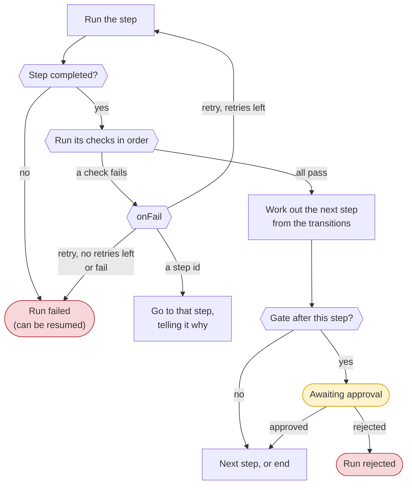
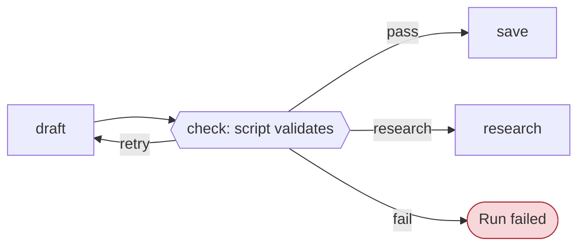
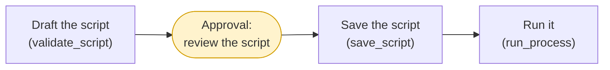
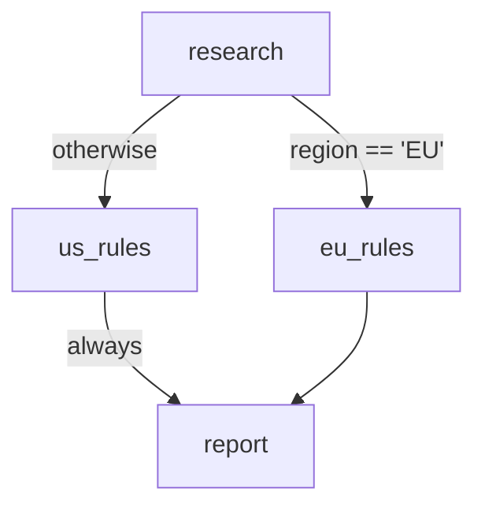
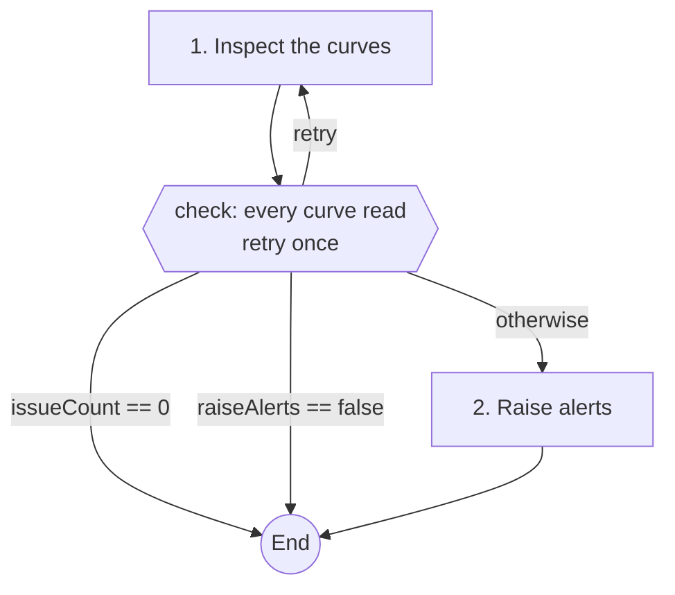

# Checks, gates and transitions

Steps do the work. Three more kinds of block control what happens between steps:

| Block | Question it answers | Runs |
|-|-|-|
| `check` | Is this step's result good enough to carry on? | After the step completes |
| `gate` | Does a person approve before the run continues? | After the step's checks pass |
| `transition` | Which step comes next? | When the step is finished |

This is what happens after every step:



---

## check

A `check` is a rule about a step's result. After the step completes, Fusion takes a second look and decides whether the rule holds, giving a short reason either way. The result of every check is recorded on the run.

```check
step: draft
rule: >
  The script @{steps.draft.script} validates without errors, reads every curve in
  @{input.curves}, and follows the naming rules in the guidance.
onFail: retry
maxRetries: 2
```

| Field | Required | Description |
|-|-|-|
| `step` | Yes | The id of the step to check. |
| `rule` | Yes | What must be true, in plain language. References are replaced by their values. |
| `onFail` | No | What to do when the rule does not hold: `retry`, `fail`, or a step id. Default `retry`. |
| `maxRetries` | No | For `retry`, how many times the step may run again. Zero or more, default `2`. |

A step can have several checks. They run in the order they appear, and the first that fails decides what happens.

**A check only looks.** While checking, Fusion can use the read-only tools and any tools the step has that do not change the platform. It can, for example, validate a script again or read a curve to confirm a number, but it can never save, create, run or send anything.

### onFail

| onFail | What happens |
|-|-|
| `retry` | The step runs again, and Fusion is told why the check failed so it can put it right. After `maxRetries` attempts the run fails. |
| `fail` | The run fails at this step with the check's reason. Use it when trying again would not help, for example when the data itself is wrong. |
| a step id | The run goes to that step, which is told which check failed and why. Going back runs that step and every step after it again. Going forward skips the steps in between. |



### Writing good rules

A rule is judged by Fusion, so it should be specific and checkable from the step's result and the data:

| Vague | Specific |
|-|-|
| The report is good | Every curve in `@{input.curves}` appears in the report, and every change is a number with two decimal places |
| The script works | The script `@{steps.draft.script}` validates with no errors and does not hard-code any dates |
| The summary is accurate | Every number in `@{steps.write.commentary}` matches a figure in `@{steps.figures.table}` |

Rules that point at values with references (`@{steps.draft.script}`) are judged on exactly what the step produced.

### Jumping back to an earlier step

An `onFail` step id is useful when a later problem means an earlier step got something wrong:

```check
step: build
rule: The report data has a row for every curve in @{steps.research.curveList}
onFail: research
```

If the check fails, the run goes back to `research`, which runs again with the reason, followed by every step after it.

---

## gate

A `gate` pauses the run after a step until a person approves or rejects it. Use a gate before any step that changes the platform, so that a person sees what is about to be saved, created, run or sent.

```gate
after: draft
message: Review the drafted script before it is saved
approvers: [ops@example.com, Data Ops]
```

| Field | Required | Description |
|-|-|-|
| `after` | Yes | The id of the step the gate follows. A step can have at most one gate. |
| `message` | No | What the approver should look at. Shown on the run and in the approval email. |
| `approvers` | No | Email addresses and user group names. Empty means anyone in the tenant may decide. |

When a run reaches a gate:

1. The run's status becomes **Awaiting approval**, and the step's result is shown with the gate's message.
2. The approvers are emailed with the step's summary and a link to the run. When there are no approvers and the run is in the background, the person who started it is emailed.
3. An approver opens the run on the **Tasks** tab and selects **Approve** or **Reject**, with an optional comment.
4. Approve carries on to the next step. Reject ends the run with the status **Rejected**.

Each decision, with who made it, when and their comment, is recorded on the run.

:::info Approving your own runs
By default, the person who started a run cannot approve its gates, so every change is seen by a second person. A tenant administrator can allow people to approve their own runs by setting the tenant property `AI_PLAYBOOK_SELF_APPROVAL` to `true`.
:::

### Where to put gates

Put the gate after the step that **prepares** the change and before the step that **makes** it, so the approver sees exactly what will happen:



One gate can cover several changing steps that follow it, as here, where approving the script also approves running it. Add another gate if the later steps deserve their own look.

The editor warns when a step uses a tool that changes the platform and no gate comes before it.

---

## transition

A `transition` chooses the step that comes after a step. Without transitions, steps run in the order they appear in the document.

```transition
from: inspect
when: "@{steps.inspect.issueCount} == 0"
to: end
```

| Field | Required | Description |
|-|-|-|
| `from` | Yes | The id of the step the transition leaves. |
| `when` | No | A condition (see below). Without one, the transition always applies. |
| `to` | Yes | A step id, or `end` to finish the run. |

How the next step is chosen when a step finishes:

1. The transitions **from** that step are tried in the order they appear in the document.
2. The **first** whose `when` holds, or that has no `when`, decides the next step.
3. If none applies, the run goes to the next step in the document, or ends after the last step.

**Going forward** skips the steps in between; they are shown as skipped on the run. **Going back** runs that step and every step after it again, which lets a playbook loop, for example to ask for more data until there is enough.

When a step has both a gate and a transition, the gate comes first: the run waits for approval and then goes where the transition says, even if that is `end`.

### Ending early

The most common transition ends a run when there is nothing more to do. This keeps scheduled runs short:

````markdown
```transition
from: inspect
when: "@{steps.inspect.issueCount} == 0"
to: end
```
````

### Branching

Two branches, joined again later. The first transition sends EU runs to `eu_rules`. Every other run falls through to the next step in the document, `us_rules`. A transition with no `when` after `eu_rules` skips `us_rules`:

````markdown
```transition
from: research
when: "@{input.region} == 'EU'"
to: eu_rules
```

```step
id: us_rules
title: Apply the US rules
instructions: Apply the US rules in the guidance to @{steps.research.data}.
produces: [result]
```

```transition
from: us_rules
to: report
```

```step
id: eu_rules
title: Apply the EU rules
instructions: Apply the EU rules in the guidance to @{steps.research.data}.
produces: [result]
```

```step
id: report
title: Write the report
instructions: Write a report from the result of the rules step that ran.
produces: [report]
```
````



### Loops

A transition back to an earlier step makes a loop. Make sure the loop has a way out:

````markdown
```transition
from: verify
when: "@{steps.verify.missing} > 0 and @{steps.verify.attempt} < 3"
to: collect
```
````

Every run also has a safety limit: it stops when it has run five times as many steps as the playbook has, in total, which catches a check or transition that sends it round in circles. A stopped run can be resumed.

---

## Conditions

A transition's `when` is a condition built from references, values and operators.

| Element | Examples |
|-|-|
| References | `@{input.raiseAlerts}`, `@{steps.inspect.issueCount}` |
| Text, in single or double quotes | `'EU'`, `"monthly"` |
| Numbers | `0`, `15`, `2.5` |
| Keywords | `true`, `false`, `null` |
| Comparisons | `==`, `!=`, `<`, `<=`, `>`, `>=` |
| Logic | `and`, `or`, `not` |
| Grouping | `( ... )` |

How values are compared:

- When both sides are numbers, they are compared as numbers: `"10" > 9` is true.
- Otherwise they are compared as text. `true` and `false` match whatever their case.
- A reference that has no value, for example from a skipped step, equals `null`. Comparing it with `<`, `<=`, `>` or `>=` is always false.
- A reference on its own is true when it has a value that is not `false`, `0` or empty: `when: "@{input.sendEmail}"`.
- `not` binds tighter than `and`, and `and` binds tighter than `or`. Use parentheses to make your meaning clear.

### Examples

| Condition | True when |
|-|-|
| `"@{steps.inspect.issueCount} == 0"` | The step found no issues |
| `"@{input.raiseAlerts} == false"` | The Raise alerts box was not ticked |
| `"@{input.region} == 'EU'"` | The region is EU |
| `"@{steps.check.rows} > 0 and not @{input.dryRun}"` | There are rows and this is not a dry run |
| `"@{steps.verify.status} != 'ok' or @{steps.verify.warnings} >= 5"` | The status is not ok, or there are five or more warnings |
| `"(@{input.excel} or @{input.csv}) and @{steps.build.rows} > 0"` | A file format was chosen and there is data |
| `"@{steps.lookup.curve} == null"` | The lookup step produced no curve |
| `"@{input.recipients}"` | Recipients were filled in |

:::tip Quoting conditions
YAML does not allow a plain value to start with `@`, so values that start with `@` are quoted for you. Quoting the whole condition in double quotes yourself is still a good habit, especially when it contains `: ` or `#`. Inside double quotes, use single quotes for text: `"@{input.region} == 'EU'"`.
:::

The editor checks every condition when the playbook is saved. A condition that cannot be read, such as one using `=` instead of `==`, is an error with its line number.

---

## Putting it together

This part of the [Curve quality check](/docs/topics/fusion-ai-playbooks/examples) playbook uses all three blocks. The `inspect` step is checked, then two transitions end the run early when there is nothing to report, or when alerts are switched off:

````markdown
```check
step: inspect
rule: >
  Every curve in the list was read and every requested check was run on it
  (@{steps.inspect.curvesChecked} curves checked), and each finding names the curve,
  the tenor where there is one, and the values that triggered it.
onFail: retry
maxRetries: 1
```

```transition
from: inspect
when: "@{steps.inspect.issueCount} == 0"
to: end
```

```transition
from: inspect
when: "@{input.raiseAlerts} == false"
to: end
```

```step
id: alert
title: Raise alerts
tools: [raise_alert]
instructions: >
  Raise one alert per curve that has findings ...
produces: [alertCount]
```
````


