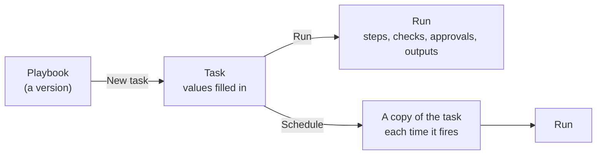
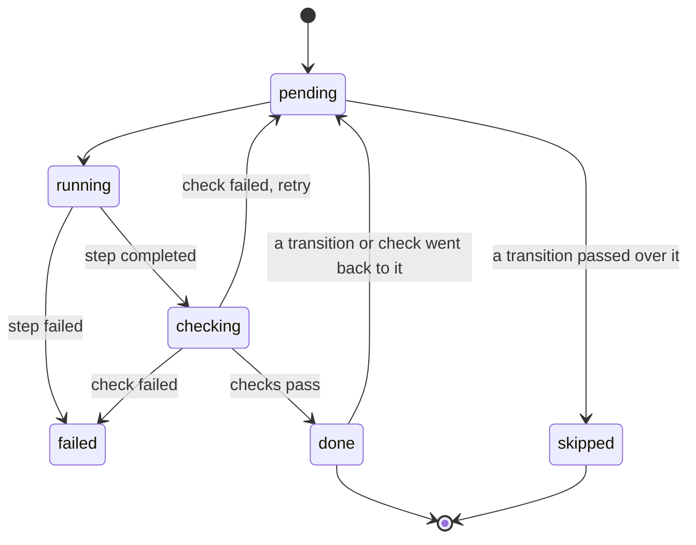

# Running playbook tasks

To use a playbook, you create a **task** from it: a form with one field for each of the playbook's inputs. You fill it in and run it, and the **run** records everything that happens.



A task is tied to the playbook version it was created from, so editing the playbook later does not change it. One task has one run. To run the same job again, **Clone** the task, which copies its values into a new draft.

---

## Creating a task

You can create a task in four places:

- **Tasks** tab: choose a playbook from the list, which shows your own playbooks and the library, then select **New task**
- **Playbooks** tab: open a playbook and select **New task**
- **Library**: open a library playbook and select **New task**, to run it without copying it
- **Fusion chat**: ask Fusion to run a playbook (see [Library and chat](/docs/topics/fusion-ai-playbooks/library-and-chat))

The task shows:

- A **name**, so you can find the task later
- The **form**, one field per input, grouped by the playbook's headings, with each field's help and validation
- The **plan**: the steps, with their checks, approvals and the tools they use, and what the playbook delivers
- **Show diagram**: the playbook as a flow diagram

### Suggest values

**Suggest values** asks Fusion to fill in the form for you. You can add a hint such as "use the EU power curves". Fusion looks up real names on the platform, such as curve ids and dataset ids, so the values it suggests exist. Values you have already entered are kept, unless they are invalid.

---

## Running a task

There are two ways to run a task:

| | **Run** | **Run in background** |
|-|-|-|
| Where it runs | Driven from the page, one step at a time, with live progress | On the platform, one step at a time, with the page closed |
| Keep the page open? | Yes. Switch to the background at any time with **Continue in background**. | No |
| Approvals | The run pauses on the page | Approvers are emailed |
| Best for | Watching a new playbook work, short jobs | Long jobs, and anything with approvals by other people |

While a run is in progress, each step shows its state:



As each step finishes, the run view shows its summary, the values it produced and the result of each check with its reason. Steps that a transition passed over are shown as skipped. The diagram is coloured by the state of each step.

**Cancel run** stops a run that is in progress.

### Run statuses

| Status | Meaning |
|-|-|
| **Draft** | The task has not run yet. Its values can be edited. |
| **Scheduled** | The task has a schedule. Each time it fires, a copy runs. |
| **Running** | The run is working through its steps. |
| **Awaiting approval** | The run is paused at a gate. |
| **Done** | The run finished. Its outputs are shown. |
| **Failed** | A step failed, or a check still failed after its retries. Can be resumed. |
| **Stopped** | The run hit a limit: its token cap, the tenant's Fusion AI limit, or the safety limit on steps. Can be resumed. |
| **Rejected** | An approver rejected the run at a gate. |
| **Cancelled** | Someone cancelled the run. |

---

## Approvals

When a run reaches a [gate](/docs/topics/fusion-ai-playbooks/flow#gate), it pauses with the status **Awaiting approval**. The gate's message and the step's result are shown, so the approver can see what they are approving.

- The gate's approvers, named people and members of named user groups, are emailed with a link to the run.
- An approver opens the run on the **Tasks** tab and selects **Approve** or **Reject**, adding a comment if they wish.
- Approve continues the run, in the page or in the background as it was running before. Reject ends it.

By default you cannot approve a run you started. A tenant administrator can change this with the tenant property `AI_PLAYBOOK_SELF_APPROVAL`.

---

## Schedules

Give a task a **schedule** and it runs automatically. Enter a cron entry in the task's **Schedule** section:

```
minute hour day-of-month month day-of-week year [timezone]
```

| Schedule | Runs |
|-|-|
| `0 7 * * MON-FRI * EU1` | 07:00 every weekday, UK time |
| `30 18 * * MON-FRI * EU2` | 18:30 every weekday, Central European time |
| `0 6 1 * ? * UTC` | 06:00 UTC on the first day of every month |
| `0 9 * * MON * EU1` | 09:00 every Monday, UK time |

The timezone is `UTC`, `EU1` (UK and Portugal) or `EU2` (most of Western Europe); `EU1` and `EU2` follow daylight saving time.

See [CRON expressions](/docs/kb/cron) for the full syntax.

How scheduled tasks work:

- The scheduled task is a template. Each time the schedule fires, a **copy** of the task runs in the background, so every run has its own record.
- The copy runs as the person who saved the schedule, with their access rights.
- Every required value must be filled in, because there is no one to ask.
- Approvers are emailed at each gate, as for any background run.
- **Schedule enabled** pauses and restarts the schedule without losing it.
- The task shows when the schedule last fired, with a link to that run, or why it did not start.

Running a scheduled task by hand runs a copy now and leaves the schedule as it is.

:::tip
Playbooks that run on a schedule should end early when there is nothing to do, using a [transition to end](/docs/topics/fusion-ai-playbooks/flow#ending-early). The [Curve quality check](/docs/topics/fusion-ai-playbooks/examples) runs every morning but only raises alerts when it finds a problem.
:::

---

## Resuming a run

A run that **failed** or **stopped** can be resumed with **Resume**. It starts again from the step that stopped it:

- That step runs again with its retries cleared, and Fusion is told why it stopped last time.
- Steps that were already done keep their results.
- A run that stopped at its token cap gets another allowance of the playbook's `maxTokens`. Resuming is your decision to spend more.
- The step safety limit starts again.

Every resume is recorded on the run, with who resumed it and when.

---

## Limits and costs

Each run is bounded by:

| Limit | Set by | When reached |
|-|-|-|
| Token cap | The playbook's `maxTokens`, default 1,000,000 | The run stops and can be resumed |
| Fusion AI limit | Your tenant's Fusion AI budget settings | The run stops until the limit allows more |
| Step safety limit | Five times the number of steps | The run stops; usually a sign of a loop |

Each run records the tokens used by each step. Tokens used by playbook runs count towards your Fusion AI usage in the same way as chats.

---

## Monitoring runs

The **Fusion AI Playbook Runs** insight shows playbook use across your tenant:

- Runs by playbook and by user, with success rates
- Failed and stopped runs, with their reasons
- Tokens per run
- Each run's steps, check results and approvals

The **Fusion AI Token Usage** and **Fusion AI Billing** insights show the tokens playbook runs use, alongside your other Fusion AI use.
