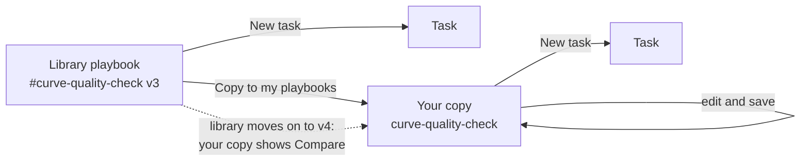

# The library, extensions and chat

## Where playbooks come from

Every tenant can use two sets of playbooks:

| | **Library** | **My playbooks** |
|-|-|-|
| Who writes them | OpenDataDSL | Your tenant, or an extension you install |
| Id | Starts with `#`, for example `#curve-quality-check` | Any id, for example `curve-quality-check` |
| Can you run them? | Yes, as they are | Yes |
| Can you edit them? | No. Copy one to customise it. | Yes |
| Updates | OpenDataDSL improves them over time | Your own versions |



---

## The library

The **Library** tab on the **Playbooks** view shows the OpenDataDSL playbooks as cards, grouped by category, with featured playbooks first. Search by name, description or tag, or filter by category.

Open a playbook to see:

- **What it does**: its description and guidance
- **Flow**: the playbook drawn as a diagram, with its steps, checks, approvals and transitions
- **You will be asked for**: the inputs, with their help
- **Tools it uses**, and whether it **saves to the platform**
- **Versions**: its history, and what changed between versions

From there:

- **New task** runs the library playbook as it is. Each task records the library version it ran.
- **Copy to my playbooks** creates your own copy to customise.

### Keeping a copy up to date

A copy remembers the library playbook and version it came from. When OpenDataDSL publishes a newer version, the copy shows a notice:

1. Select **Compare** to see what changed in the library between the version you copied and the latest.
2. Make the changes you want in your copy, and **Save**.
3. Select **Mark as up to date**, so the notice only comes back when the library changes again.

Your changes are never overwritten. Bringing library improvements into your copy is always your choice.

---

## Playbooks in extensions

An [extension](/docs/odsl/extension/extension-basics) can add playbooks to the tenants that install it, the same way it adds scripts, policies or AI assistants. Playbooks an extension installs appear in **My playbooks**.

Save the playbook in your tenant, then list it in the extension's resources under the `aiplaybook` service:

```js
e.resources.aiplaybook = ["dataset-delivery-summary", "late-delivery-escalation"]
```

This is a good way to ship a set of playbooks with the insights and assistants that go with them, for example a market data extension that includes its own quality check and onboarding playbooks.

---

## Running a playbook from the chat

You can ask Fusion to run a playbook in an ordinary Fusion AI chat:

> **You:** Run the curve quality check for the NBP and TTF settlement curves, with a 10% limit on moves.

Fusion:

1. Finds the playbook that matches, from the library or your own playbooks.
2. Reads its inputs and fills in a draft task from the conversation, using the values you gave and the playbook's defaults. It does not guess values it was not given.
3. Shows the task in the chat as a card with the values, anything still needed, and the playbook's steps and approvals.

> **Fusion AI:** I've prepared a **Curve quality check** task for the NBP and TTF settlement curves, checking for big moves above 10%, missing tenors, stale curves and bad prices, and raising alerts for any problems it finds. It's ready to run from the card below.

From the card:

- **Run in background** runs the task. Any approvals are emailed.
- **Open on Tasks tab** opens the task to check or change the values, add a schedule, or run it in the page.

**Fusion never starts a run itself.** Nothing happens until you press Run. If required values are missing, the card lists them and Fusion asks you for them, or you can fill them in on the Tasks tab.

Some ways to ask:

> Which playbooks do we have for datasets?

> Set up monitoring for the ICE.NDEX.NLB dataset using the onboarding playbook.

> I need a daily report on the German power curves with day-on-day changes. Is there a playbook for that?

> Prepare the month-end market summary for September for the trading desk, emailed to markets@example.com.
