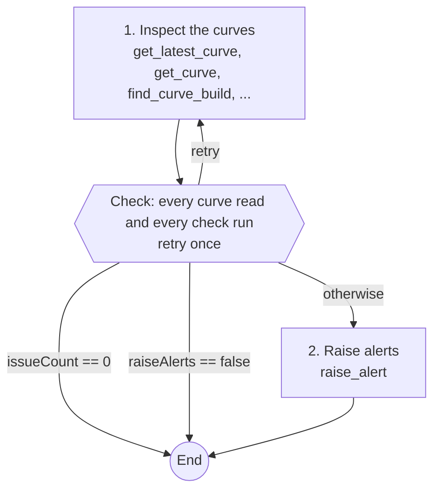
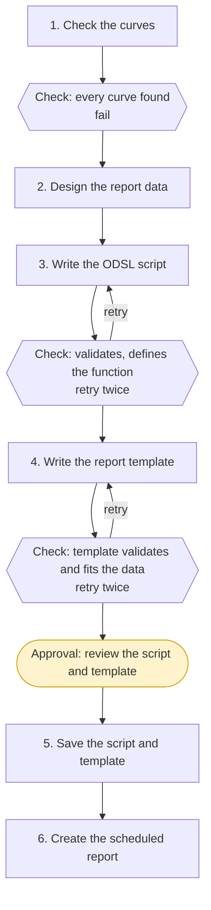
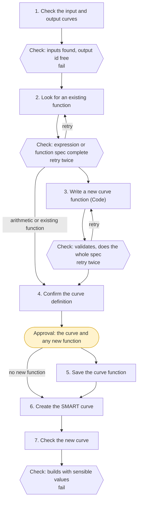
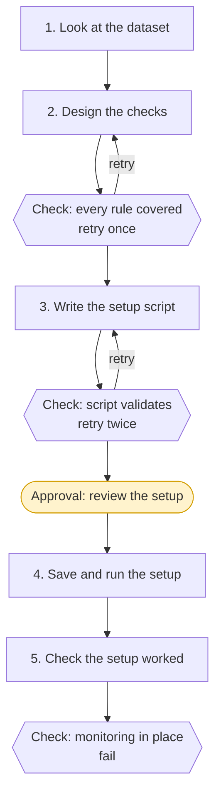
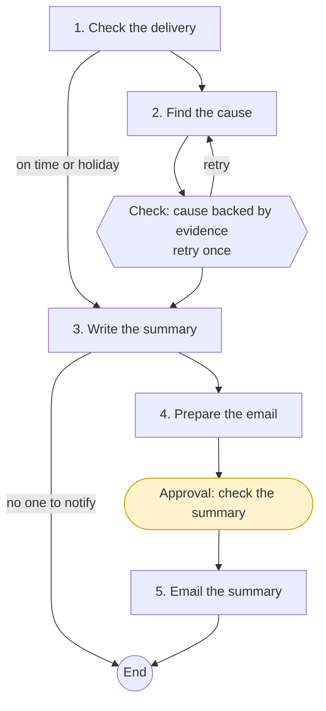
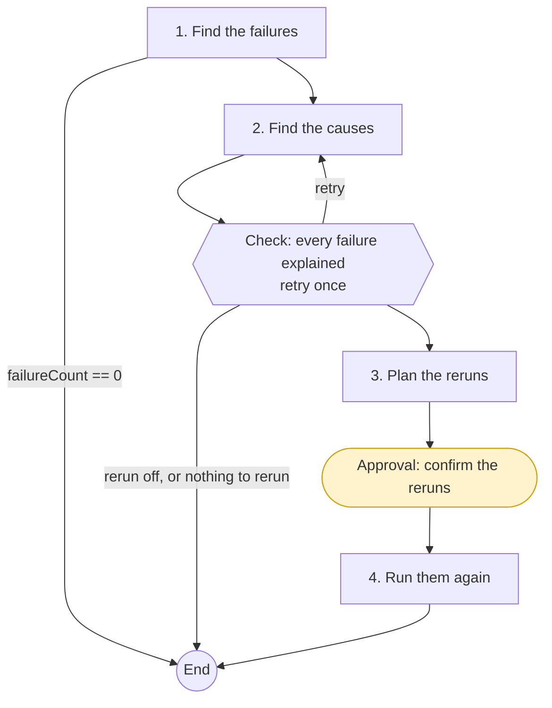
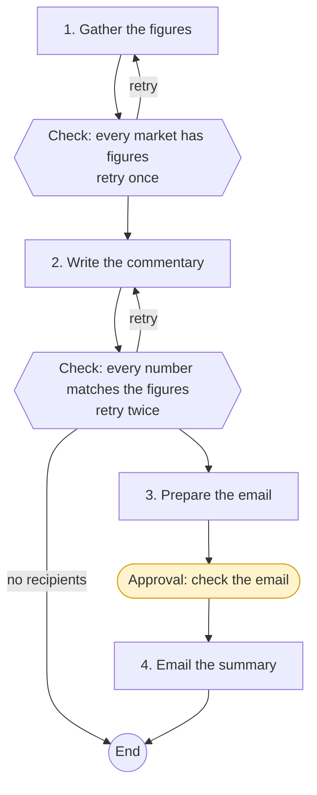

# Example playbooks

This page walks through a complete library playbook, then shows the flow of each of the other playbooks in the OpenDataDSL library. You can open any of them in the **Library** tab, run it as it is, or copy it to use as the starting point for your own.

---

## Curve quality check, in full

The **Curve quality check** (`#curve-quality-check`) reads a set of forward curves and looks for big day-on-day moves, missing tenors, stale curves, bad prices and shape breaks. When it finds problems, it raises one alert per curve. It is designed to run on a schedule, for example every weekday 30 minutes after the curves are due.



### The source

````markdown
---
id: '#curve-quality-check'
name: Curve quality check
category: Curves
assistant: Curve
description: Checks forward curves for big moves, missing tenors, stale data and bad prices, and raises alerts for what it finds
icon: shield-check text-success
tags: [curves, quality, alerts, scheduled]
maxTokens: 1000000
---

Checks a set of forward curves after they build each day. Run it by hand after a
build, or give the task a schedule (for example 30 minutes after the curves are due)
so it runs every day and raises alerts only when something is wrong.

## What counts as a problem

- **Big move**: a contract's price changed from the previous curve by more than the
  allowed percentage. Front contracts near expiry move more, so report the tenor.
- **Missing tenor**: a tenor that should be on the curve is not there, or a curve has
  fewer contracts than the curve before it.
- **Stale curve**: the latest curve is older than the allowed business days, using the
  curve's own calendar and holidays, so a holiday is not reported as stale.
- **Bad price**: a zero, negative (unless the market allows negative prices, as power
  does) or empty value.
- **Shape break**: a contract that is far out of line with its neighbours, for example
  one month 30% above the months either side, which usually means a bad input.

Report each problem once, with the curve, tenor, values and why it counts. Do not
report the same root cause many times: a stale curve is one finding, not one per
contract.

## What to check

```input
name: curves
label: Curves
type: longtext
required: true
help: One curve id per line, for example ICE.NDEX.NLB:SETTLE
```

```input
name: checks
label: Checks to run
type: multichoice
options: [Big moves, Missing tenors, Stale curve, Bad prices, Shape breaks]
default: [Big moves, Missing tenors, Stale curve, Bad prices]
```

```input
name: maxMove
label: Largest allowed move (%)
type: number
default: 15
validate: {min: 1, max: 200}
help: Day-on-day change per contract above which a move is reported
```

```input
name: expectedTenors
label: Tenors every curve must have
type: text
help: Optional, for example M1-M3, Q1-Q2, Cal1
```

```input
name: staleDays
label: Business days before a curve is stale
type: number
default: 1
validate: {min: 0, max: 10}
```

## Alerts

```input
name: raiseAlerts
label: Raise alerts for problems found
type: boolean
default: true
```

```input
name: impact
label: Alert impact
type: choice
options: [low, medium, high, critical]
default: medium
```

## Steps

```step
id: inspect
title: Inspect the curves
tools: [get_latest_curve, get_curve, find_curve_build, get_holidays, read_service_data]
instructions: >
  Check each of these curves:

  @{input.curves}

  Run these checks: @{input.checks}. Big moves are changes from the previous curve
  above @{input.maxMove}%. Expected tenors: @{input.expectedTenors}. A curve is stale
  when its latest ondate is more than @{input.staleDays} business days old on its own
  calendar. Where a curve looks wrong, look at its latest build with find_curve_build
  for the cause.

  Set findingsTable to a markdown table of curve, tenor, check, values and reason,
  sorted by curve then check, issueCount to the number of findings, curvesChecked to
  how many curves you read, and summary to two or three sentences on the overall state.
produces: [findingsTable, issueCount, curvesChecked, summary]
```

```check
step: inspect
rule: >
  Every curve in the list was read and every requested check was run on it
  (@{steps.inspect.curvesChecked} curves checked), and each finding names the curve,
  the tenor where there is one, and the values that triggered it.
onFail: retry
maxRetries: 1
```

```transition
from: inspect
when: "@{steps.inspect.issueCount} == 0"
to: end
```

```transition
from: inspect
when: "@{input.raiseAlerts} == false"
to: end
```

```step
id: alert
title: Raise alerts
tools: [raise_alert]
instructions: >
  Raise one alert per curve that has findings, not one per contract. Use the curve id
  as the name, today's date as the ondate, type curve, impact @{input.impact}, issue
  quality, and a message listing that curve's findings from this table:

  @{steps.inspect.findingsTable}

  Report how many alerts were raised as alertCount.
produces: [alertCount]
```

```output
name: findings
type: text
from: steps.inspect.findingsTable
description: Every problem found
```

```output
name: summary
type: text
from: steps.inspect.summary
description: The overall state of the curves
```

```output
name: alerts
type: number
from: steps.alert.alertCount
description: Alerts raised
```
````

### How it works

| Part | What it does |
|-|-|
| **Front matter** | The id starts with `#` because it is a library playbook, so it is quoted. The `Curve` assistant runs every step. |
| **Prose: What counts as a problem** | Defines each kind of problem once, including the awkward cases: front contracts move more, holidays are not stale, negative prices are allowed for power. Both steps follow it. |
| **Inputs** | `curves` is a `longtext`, one id per line. `checks` is a `multichoice` with sensible defaults. `maxMove` and `staleDays` are validated numbers. The `## Alerts` heading groups the last two inputs on the form. |
| **Step `inspect`** | Has only read tools. It produces a table for people (`findingsTable`), a count for the transitions (`issueCount`), a number the check can verify (`curvesChecked`) and a `summary`. |
| **Check** | Makes sure nothing was missed and every finding has its evidence. One retry, with the reason, is usually enough. |
| **Transitions** | End the run when there is nothing to report, or when alerts are switched off. On most days a scheduled run ends here, cheaply. |
| **Step `alert`** | The only step that changes anything. It raises one alert per curve, not one per contract. |
| **Outputs** | The findings table, the summary and the number of alerts raised. |

:::note A deliberate warning
The editor warns that `alert` uses `raise_alert` with no gate before it. That is intended here: raising an alert is how this playbook tells people about a problem, and waiting for approval would defeat a scheduled check. Leave out gates only for changes that are low risk and expected, as here.
:::

---

## The other library playbooks

### Scheduled curve report

`#scheduled-curve-report` builds a scheduled report on curves you choose, with optional day-on-day changes, spreads and calendar spreads. It writes and validates an ODSL script and a report template, then, after approval, saves both and creates the report with its schedule.



Note the first check uses `onFail: fail`: if a curve does not exist, trying again will not help, so the run stops and says which curve is missing.

### Build a SMART curve

`#smart-curve-builder` creates a SMART curve from the input curves, output id and logic you give it. It looks for the simplest way to express the logic first: plain arithmetic such as `BASE - VAR1`, then a built-in curve function or one of your own curve-build functions. Only if nothing existing fits does it hand over to the Code assistant to write a new curve function. After approval it saves the function as a `curve-build` script, creates the SMART curve, and reads the new curve back to check it builds.



Each step can name its own assistant: the Curve assistant checks the curves and looks for a function, and the Code assistant writes a new one only when it is needed. One approval covers both the new function and the curve, so nothing is saved until the whole definition has been reviewed.

### Dataset onboarding

`#dataset-onboarding` sets up monitoring for a dataset: completeness and quality checks from rules written in plain words, applied by a setup script that is run and then verified.



### Late dataset investigation

`#late-dataset-investigation` works out why a dataset delivery was late or incomplete. If the delivery was on time, or the day was a holiday, it skips the investigation. It writes a short root-cause summary and, if you asked for it, emails it after approval.



The transition to `end` comes before the email is prepared, and the gate is after the step that prepares it. A gate always waits for approval once its step is done, so placing it here means a run with no one to notify finishes without asking anyone.

### Process failure triage

`#process-failure-triage` finds failed process runs that have not already been fixed by a rerun, groups them by root cause with evidence from the logs, and, after approval, reruns the ones a rerun can fix.



### Month-end market summary

`#month-end-market-summary` gathers each market's average, range and move for the month, writes commentary for your audience, checks every number against the figures, and emails the summary after approval. Give it a schedule such as `0 6 1 * ? * EU1` to run on the first of each month.



---

## Patterns to reuse

| Pattern | Used in | How |
|-|-|-|
| End quietly when there is nothing to do | Curve quality check, Process failure triage | A transition to `end` on a count of zero |
| Draft, check, approve, then change | Scheduled curve report, Dataset onboarding | Validate in a check with `retry`, gate, then the step with the changing tool |
| Stop when retrying cannot help | Scheduled curve report, Dataset onboarding | A check with `onFail: fail` on facts about the data |
| Skip work that is not needed | Late dataset investigation | A forward transition past the investigation step |
| Optional email | Late dataset investigation, Month-end market summary | A transition to `end` when there are no recipients, before the step and gate that prepare the email |
| Reuse before you build | Build a SMART curve | A step that looks for an existing function first, and a transition that skips the Code step when one fits |
| Numbers checked against the source | Month-end market summary | A check whose rule compares the commentary with the figures step's table |
