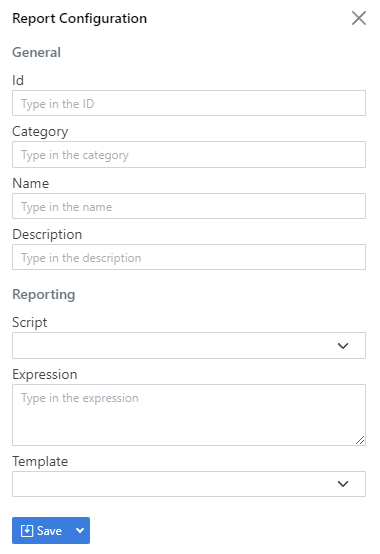

import Tabs from '@theme/Tabs';
import TabItem from '@theme/TabItem';

## What is reporting?

Reporting in OpenDataDSL is a way of creating a document which represents a report which can be rendered as HTML, JSON or read into Excel.

### Report configuration

A report is based on a user defined configuration with the following properties:

|Name|Description|Type|
|-|-|-|
|_id|Unique Id|String|
|category|The user-defined category of the report used to organise reports|String|
|name|The user-friendly name of the report|String|
|description|A description of the report|String|
|fixed|A flag indicating that this report is manually updated rather than calculated|Boolean|
|script|The name of the script used to run this report|String|
|expression|The expression to use to run this report, e.g. a function name|String|
|template|The mustache template name used to format the results of the report as HTML|String|
|tags|A list of tags for the report|List|

Report configurations are versioned, so they also contain version information:

|Name|Description|Type|
|-|-|-|
|_version|The auto-incrementing version number|Integer|
|_user|The user who created this version|String|
|_timestamp|The timestamp of when this version was created|Date|
|_tag|Version tags used to identify this version by a user-friendly name, e.g. PROD|List|

### Report

A report contains all the information from the configuration that built/saved it, plus the following:

|Name|Description|Type|
|-|-|-|
|data|The actual report data that was created|Any|
|scriptVersion|The version number of the script that was used to generate this report|Integer|
|errorMessage|An error message if this script failed|String|
|start|The start date of the range used to build this report|Date
|end|The end date of the range used to build this report|Date

A report is also versioned, so it contains version information too.

## Creating a report

### Script

Script is an optional property that defines the name of the ODSL script used to create a report.

The script must contain functions, like the example below, and you use the ```expression``` property to specify which function to call and give the parameters.

Here is an example of a script to create a report

```js
/**
 * @category report
 * Example functions for creating reports
 */

function userMetrics()
    userMetrics = aggregate ${metric}
        match user != null and timestamp >= #START and timestamp <= #END
        group _id="$user", value=sum(1)
    end
end
```

:::note
There are 2 variables created in the report context ```#START``` and ```#END``` representing the start and end dates of the range used when running this report.
:::

### Expression

Expression is the property that defines the command to run, which is usually the function call to the script, but can be a standalone expression, e.g.

```js
${data:"AAA:TIMESERIES"}
```

For the example using the script above, our expression would be:

```js
userMetrics()
```

### Fixed

Fixed is a boolean property to indicate that this report does not use a script or expression and is manually updated by a user.

An example configuration for a fixed report:

```js
FIXED_EXAMPLE = Report()
FIXED_EXAMPLE.name = "Fixed Report Example"
FIXED_EXAMPLE.description = "An example of how to use a fixed report"
FIXED_EXAMPLE.fixed = true
save FIXED_EXAMPLE
```

Saving a fixed report - you can save any variable as a report and it will save as data for the report with the same **id** as the variable, e.g.

```js
FIXED_EXAMPLE = Object()
FIXED_EXAMPLE.title = "This is my new report"
FIXED_EXAMPLE.data = ["This", "is", "some", "data"]
save ${report:FIXED_EXAMPLE}
```

### Template

Template is an optional property and is the name of a mustache template saved as a script in OpenDataDSL.

If you don't specify a template, the resultant report will be json except in the following situation:

> If the report is an array of objects, and the objects all have the same property names, a dynamic template is used to show the data as a HTML table.

An example mustache template for the user metrics function:

```html
<h1>Usage Metrics by User</h1>

<h2>{{description}}</h2>

<p>For the range: {{start}} - {{end}}</p>

<table>
    <thead>
        <tr>
            <th>User</th>
            <th>Usage</th>
        </tr>
    </thead>
    <tbody>        
        {{# data }}
            <tr>
                <td>{{_id}}</td>
                <td>{{value}}</td>
            </tr>
        {{/ data }}
    </tbody>
</table>
```

### Tools to create a report

<Tabs groupId="tool">
<TabItem value="portal" label="Web Portal" default>

* Select **Reports**
* Select Private.
* Click the + New button
  > You will see a sidebar dialog like this to enter details of the report configuration
  

* Enter a unique id for this report in the Id field
* Type a category for this report, this is used to group similar reports together to make them easier to navigate
* Enter a name and description for this report
* Select an ODSL report script from the drop-down list
* Type in the name of the function to run in the expression box, or leave blank if you just need to run the script directly
* Optionally select a template from the dropdown list of mustache template to format this report into HTML.
* Click the **Save** button to save this configuration


</TabItem>
<TabItem value="odsl" label="OpenDataDSL">

```js
USER_METRICS = Report()
USER_METRICS.category = "Tutorial"
USER_METRICS.name = "User Metrics Summary"
USER_METRICS.description = "Summarise the usage metrics by user"
USER_METRICS.script = "report_functions"
USER_METRICS.expression = "userMetrics()"
USER_METRICS.template = "UserMetricsTemplate"
USER_METRICS.tags = ["tutorial", "example"]

save USER_METRICS
```

</TabItem>
<TabItem value="rest" label="REST API">

```js
POST https://api.opendatadsl.com/api/report/v1
Authorization: Bearer {{token}}

{
    "_id": "USER_METRICS",
    "_type": "VarReportConfiguration",
    "category": "Tutorial",
    "name": "User Metrics Summary",
    "description": "Summarise the usage metrics by user",
    "script": "report_functions",
    "expression": "userMetrics()",
    "tags": ["tutorial", "sample"]
}
```

</TabItem>
</Tabs>

## Running a report

:::note
You can't run a **fixed** report
:::

There are 2 ways to run a report:
* Dynamically run a report to see what it looks like without saving
* Run and save a report

### Dynamically running a report

<Tabs groupId="tool">
<TabItem value="portal" label="Web Portal" default>

* Select **Reports**
* Select Public for public reports or Private for your own reports.
* Find the report you want to run by filtering or scrolling
* Specify the date range you want to run the report for using the range selector
* Click the **Run** button

</TabItem>
<TabItem value="odsl" label="OpenDataDSL">

```js
rep = run report USER_METRICS with "between(2023-01-01,2023-01-31)"
print rep
```

</TabItem>
<TabItem value="rest" label="REST API">

```js
GET https://api.opendatadsl.com/api/report/v1/private/USER_METRICS
  ?_range=between(2023-01-01,2023-01-31)
Authorization: Bearer {{token}}
```

</TabItem>
</Tabs>

### Run and save a report

<Tabs groupId="tool">
<TabItem value="portal" label="Web Portal" default>

* Select **Reports**
* Select Public for public reports or Private for your own reports.
* Find the report you want to run by filtering or scrolling
* Specify the date range you want to run the report for using the range selector
* Click the **Run** button

</TabItem>
<TabItem value="odsl" label="OpenDataDSL">

```js
save ${report:"USER_METRICS"}
```

</TabItem>
<TabItem value="rest" label="REST API">

```js
POST https://api.opendatadsl.com/api/report/v1/private/USER_METRICS
  ?_range=between(2023-01-01,2023-01-31)
Authorization: Bearer {{token}}
```

</TabItem>
</Tabs>